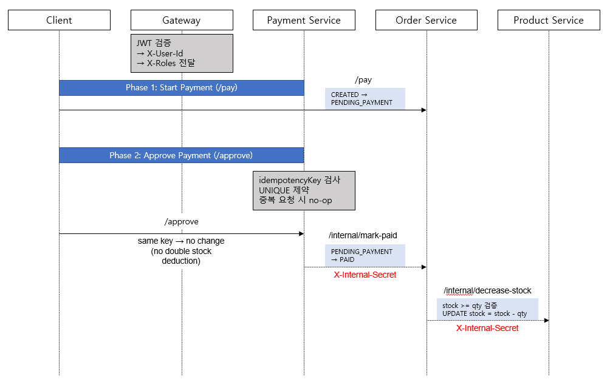

# MSA Shop v2

> Spring Boot 3.2 기반 MSA 쇼핑몰 실무 시뮬레이션 프로젝트\
> 실무에서 사용해보지 못한 아키텍처와 기술 스택을 직접 설계·구현하며
> 학습한 프로젝트

------------------------------------------------------------------------

## 🎯 프로젝트 목적

현재 실무에서는 사용하지 않는 기술 스택과 아키텍처 구조를\
직접 설계하고 구현해보며 다음을 검증하기 위해 진행한 프로젝트입니다.

-   MSA 구조 이해 및 서비스 경계 설계 능력 확보
-   도메인 기반 상태 통제 설계 경험
-   결제 API 멱등성(Idempotency) 설계 경험
-   JWT 기반 인증/인가 구조 설계 경험
-   분산 트랜잭션 없이 일관성 유지 전략 구현

단순 기능 구현이 아니라,\
**"왜 이렇게 설계했는가"에 집중한 프로젝트입니다.**

------------------------------------------------------------------------

## 🏗 전체 아키텍처


각 서비스는 자신의 데이터베이스를 소유하며\
타 서비스 DB에 직접 접근하지 않습니다.

------------------------------------------------------------------------

## 🔐 인증 및 보안 설계

### 1️⃣ Gateway 단일 JWT 검증 구조

-   JWT 검증은 Gateway에서만 수행
-   검증 성공 시 `X-User-Id`, `X-Roles` 헤더로 Downstream 전파

**선택 이유** - 인증 책임 단일화 - 하위 서비스 JWT 파싱 제거 - 로직 중복
방지 - 테스트 단순화

------------------------------------------------------------------------

### 2️⃣ Access / Refresh Token 설계

-   Access Token: RS256 기반 JWT
-   Refresh Token: HttpOnly Cookie
-   서버에는 Refresh Token 원문이 아닌 **SHA-256 해시만 저장**
-   Refresh Token Rotation 전략 적용
-   Logout 멱등 처리

**설계 의도** - DB 유출 시 토큰 원문 보호 - 재사용 공격 방지

------------------------------------------------------------------------

### 3️⃣ Downstream 보안 모델

-   `GatewayAuthHeaderFilter`로 SecurityContext 구성
-   `@AuthenticationPrincipal` 사용
-   `@PreAuthorize`로 인가 수행

인증(Authentication)과 인가(Authorization)의 책임을 분리했습니다.

------------------------------------------------------------------------

## 🧠 도메인 중심 설계

### Order Aggregate 상태 관리

``` text
CREATED
PENDING_PAYMENT
PAID
CANCELLED
```

전이 규칙

-   CREATED → PENDING_PAYMENT
-   PENDING_PAYMENT → PAID
-   CREATED / PENDING_PAYMENT → CANCELLED
-   PAID 이후 취소 불가

상태 전이 로직은 Service가 아닌 Domain 내부에서 통제합니다.


------------------------------------------------------------------------

## 💳 결제 설계 및 멱등 전략



### 멱등 전략

-   `idempotencyKey` 필수
-   DB UNIQUE 제약
-   선조회 + 충돌 처리
-   도메인 메서드 멱등 처리

동일 키 재요청 시 - Payment 트랜잭션 1건 유지 - Order 상태 추가 변경
없음 - 재고 추가 차감 없음

------------------------------------------------------------------------

## 📦 재고 차감 및 동시성 고려

``` sql
UPDATE product
SET stock = stock - :qty
WHERE product_id = :id
  AND stock >= :qty;
```

-   조건부 UPDATE로 음수 재고 방지
-   조회 후 차감 방식 회피
-   DB 원자성 활용

------------------------------------------------------------------------

## 🧪 E2E 통합 테스트

Gateway(8080) 기준 실제 HTTP 기반 통합 테스트 수행

``` bash
./gradlew :e2e-test:test
```

테스트 항목

-   로그인 성공 검증
-   권한 기반 상품 생성 검증
-   주문 생성 후 상태 확인
-   결제 승인 후 PAID 전이 검증
-   동일 idempotencyKey 재요청 검증
-   PAID 이후 cancel 실패 검증

------------------------------------------------------------------------

## ⚖ 설계 트레이드오프

의도적으로 제외한 것

-   Saga 패턴
-   Outbox 패턴
-   메시지 브로커
-   분산 트랜잭션
-   재고 예약 모델

분산 복잡성을 먼저 도입하기보다\
상태 통제와 멱등 설계에 집중했습니다.

------------------------------------------------------------------------

## 🚀 향후 확장

-   Outbox 기반 이벤트 발행
-   Saga 기반 주문--결제 오케스트레이션
-   환불 / 부분환불 모델
-   Observability (Tracing, MDC)
-   mTLS 기반 내부 통신 보안 강화

------------------------------------------------------------------------

## 🖥 로컬 실행

``` bash
docker compose -f infra/docker-compose.yml up -d
./gradlew :gateway:bootRun --args='--spring.profiles.active=local'
./gradlew :auth-service:bootRun --args='--spring.profiles.active=local'
./gradlew :user-service:bootRun --args='--spring.profiles.active=local'
./gradlew :product-service:bootRun --args='--spring.profiles.active=local'
./gradlew :order-service:bootRun --args='--spring.profiles.active=local'
./gradlew :payment-service:bootRun --args='--spring.profiles.active=local'
```

------------------------------------------------------------------------

## 📌 프로젝트를 통해 얻은 것

-   실무 미사용 기술 스택을 직접 설계·구현한 경험
-   도메인 기반 상태 통제 설계 경험
-   멱등 API 설계 경험
-   인증/인가 책임 분리 구조 이해
-   분산 트랜잭션 없이 일관성 유지 전략 이해
