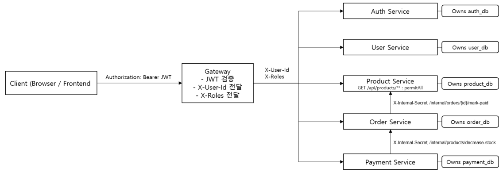
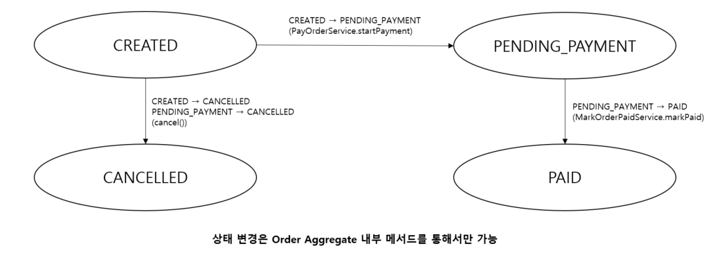
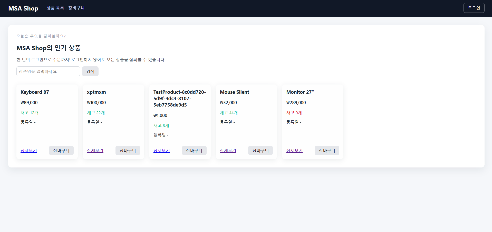
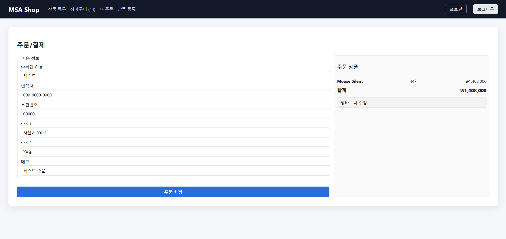
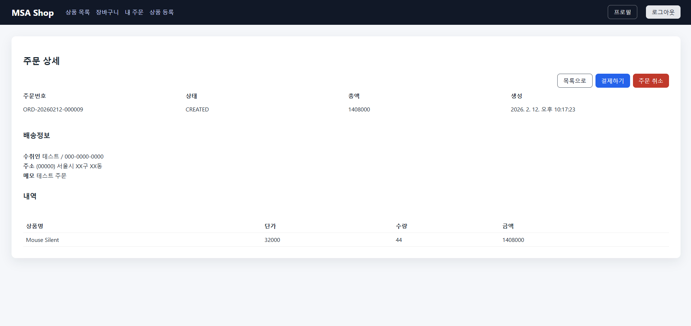

# MSA Shop v2

> Spring Boot 3.2 기반 MSA 쇼핑몰 실무 시뮬레이션 프로젝트
> 상태 전이 통제 · 결제 멱등성 · 서비스 경계 설계에 초점을 둔 구현

---

# 🎯 1. 설계 목표 (Design Goals)

이 프로젝트는 단순 CRUD 쇼핑몰이 아닙니다.

다음 설계 요소를 명확히 구현하는 것을 목표로 했습니다.

* 주문 상태 전이를 **도메인 모델에서 통제**
* 결제 승인 API의 **멱등(Idempotency) 보장**
* 서비스 간 DB 공유 금지 (데이터 경계 유지)
* Gateway 단일 JWT 검증 구조
* 내부 API 보호 전략 구현
* 분산 트랜잭션 없이 일관성 유지 설계

---

# 🏗 2. 전체 아키텍처



각 서비스는 자신의 DB를 소유하며,
다른 서비스의 데이터베이스에 직접 접근하지 않습니다.

---

# 🔐 3. 인증 및 보안 설계

## 3.1 Gateway 단일 JWT 검증 구조

* JWT는 Gateway에서만 검증
* 검증 성공 시 다음 헤더를 Downstream 서비스로 전달

    * `X-User-Id`
    * `X-Roles`

### 왜 Gateway에서만 검증하는가?

* 인증 책임을 단일 계층에 집중
* 하위 서비스 단순화
* JWT 파싱 중복 제거
* 테스트 용이성 향상

---

## 3.2 Downstream 서비스 보안 모델

하위 서비스는 JWT를 직접 검증하지 않습니다.

대신:

* `GatewayAuthHeaderFilter`가 SecurityContext 구성
* `@AuthenticationPrincipal CurrentUser`로 사용자 정보 주입
* `@PreAuthorize`로 권한 검증 수행

---

## 3.3 공개 API / 인증 API / 내부 API 구분

| 구분        | 예시                | 보호 방식             |
| --------- | ----------------- | ----------------- |
| 공개 API    | GET /api/products | permitAll         |
| 인증 필요 API | 주문/결제/내정보         | JWT 필요            |
| 내부 API    | /internal/**      | X-Internal-Secret |

📌 이 구조를 통해 “인증”과 “인가” 책임을 분리했습니다.

---

# 🧠 4. 도메인 중심 설계

## 4.1 Order Aggregate가 상태를 통제

```text
CREATED
PENDING_PAYMENT
PAID
CANCELLED
```

전이 규칙:

* CREATED → PENDING_PAYMENT
* PENDING_PAYMENT → PAID
* CREATED/PENDING_PAYMENT → CANCELLED
* PAID 이후 취소 불가

### 왜 상태를 Domain에서 관리하는가?

* 서비스 레이어 우회 방지
* 잘못된 상태 점프 방지
* 멱등 처리 자연스러운 구현
* 비즈니스 규칙 중앙 집중

---



---

# 💳 5. 결제 설계 및 멱등 처리

## 5.1 결제 승인 흐름

[//]: # (📌 **[이미지 삽입 위치 – 결제 시퀀스 다이어그램]**)

```
Client
  → Gateway
    → Payment Service (approve)
      → Order Service (/pay)
      → Order Service (/internal/mark-paid)
      → Product Service (/internal/decrease-stock)
```

---

## 5.2 멱등(Idempotency) 전략

* `idempotencyKey` 필수
* DB UNIQUE 제약
* 선조회 + 충돌 처리
* 도메인 메서드 멱등 보장

결과:

* 중복 클릭 방지
* 재고 중복 차감 방지
* 주문 상태 중복 전이 방지

---

# 📦 6. 재고 차감 전략

재고는 결제 승인 성공 후 차감합니다.

```sql
UPDATE product
SET stock = stock - :qty
WHERE product_id = :id
  AND stock >= :qty;
```

분산 트랜잭션 대신:

* 순차 전이
* 멱등 처리
* DB 원자적 업데이트

---

# 🧪 7. E2E 흐름

1. 상품 조회 (비로그인 가능)
2. 주문 생성 (CREATED)
3. 결제 시작 (PENDING_PAYMENT)
4. 결제 승인
5. 주문 상태 PAID
6. 재고 감소
7. 동일 idempotencyKey 재호출 → 변화 없음

---

# ⚖ 8. 설계 트레이드오프

적용하지 않은 것:

* Saga 패턴
* Outbox 패턴
* 메시지 브로커
* 분산 트랜잭션
* 재고 예약 모델

### 이유

분산 복잡성을 추가하기 전에
**상태 관리와 멱등성에 집중**하기 위함.

---

# 🚀 9. 향후 확장 가능성

* Outbox 기반 이벤트 발행
* Saga 기반 주문–결제 오케스트레이션
* 환불/부분환불 모델
* Observability (Tracing, MDC)
* mTLS 기반 내부 통신 보안 강화

---

# 📸 프론트엔드 화면







---

# 📌 이 프로젝트의 수준

이 프로젝트는 다음을 구현했습니다:

* 도메인 기반 상태 통제
* 멱등 설계
* 서비스 경계 유지
* 내부 API 보호 전략

단순 CRUD 예제를 넘어
실제 서비스 설계 포인트를 반영한 구조입니다.