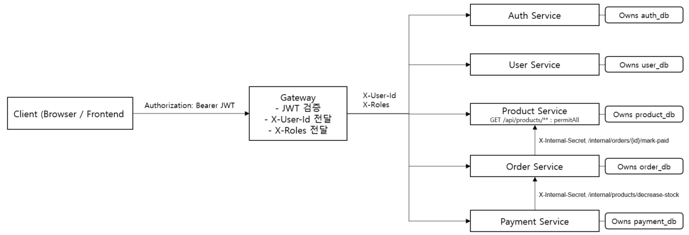
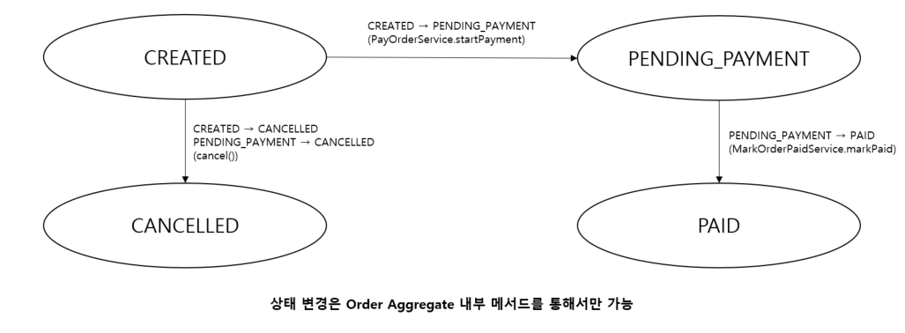
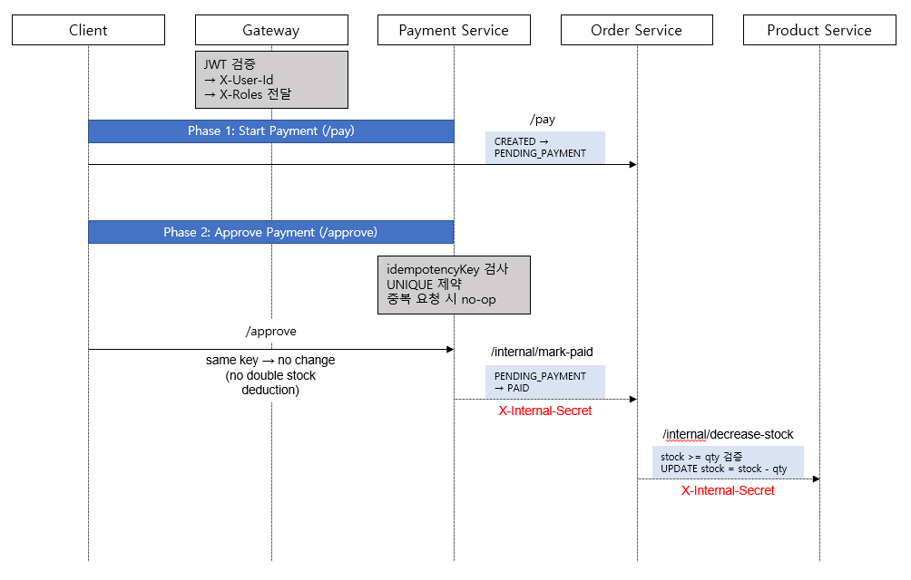

# MSA Shop v2

> Spring Boot 3.2 기반 MSA 학습/포트폴리오 프로젝트  
> 실무에서 직접 다루지 못했던 아키텍처와 운영 포인트를 직접 설계하고 구현하면서
> "왜 이렇게 설계하는가"까지 설명 가능한 상태를 목표로 한다.

------------------------------------------------------------------------

## 프로젝트를 하는 이유

이 프로젝트는 단순 기능 구현보다 다음 질문에 답하기 위해 진행한다.

- MSA에서 서비스 경계를 어떻게 나눌 것인가
- 분산 트랜잭션 없이도 데이터 정합성을 어떻게 맞출 것인가
- 결제/주문/회원가입 같은 핵심 흐름에 멱등성과 재시도 전략을 어떻게 넣을 것인가
- 인증/인가 책임을 어떤 계층에 두는 것이 운영상 유리한가
- 장애가 났을 때 재처리, 격리, 복구를 어떻게 설계할 것인가

------------------------------------------------------------------------

## 전체 아키텍처



각 서비스는 자신의 데이터베이스를 소유한다.  
다른 서비스의 DB를 직접 조회하지 않고, 필요한 통신은 HTTP 또는 Kafka 이벤트로 연결한다.

현재 주요 서비스는 다음과 같다.

- `gateway`
- `auth-service`
- `user-service`
- `product-service`
- `order-service`
- `payment-service`

------------------------------------------------------------------------

## 인증 및 보안 설계

### 1. Gateway 단일 JWT 검증

- JWT 검증은 Gateway에서만 수행한다.
- 검증 성공 시 `X-User-Id`, `X-Roles` 헤더를 downstream 서비스로 전달한다.
- 하위 서비스는 전달된 인증 컨텍스트를 기반으로 인가만 수행한다.

이 구조를 선택한 이유는 다음과 같다.

- JWT 파싱 로직을 서비스마다 중복하지 않기 위함
- 인증 책임을 단일 계층으로 모아 운영 복잡도를 낮추기 위함
- downstream 서비스 테스트를 단순화하기 위함

### 2. Access / Refresh Token 전략

- Access Token: RS256 기반 JWT
- Refresh Token: HttpOnly Cookie
- 서버에는 Refresh Token 원문 대신 SHA-256 해시만 저장
- Refresh Token Rotation 적용
- Logout 멱등 처리

### 3. Downstream 인가 처리

- `GatewayAuthHeaderFilter` 로 `SecurityContext` 구성
- `@AuthenticationPrincipal` 사용
- `@PreAuthorize` 로 권한 제어

즉 인증(Authentication)은 Gateway, 인가(Authorization)는 각 서비스 책임으로 분리했다.

------------------------------------------------------------------------

## 도메인 상태 통제

### Order Aggregate 상태 전이

```text
CREATED
PENDING_PAYMENT
PAID
CANCELLED
```

상태 전이 규칙은 다음과 같다.

- `CREATED -> PENDING_PAYMENT`
- `PENDING_PAYMENT -> PAID`
- `CREATED / PENDING_PAYMENT -> CANCELLED`
- `PAID` 이후 취소는 불가

상태 전이 규칙은 service 레이어가 아니라 domain 레이어에서 통제한다.



------------------------------------------------------------------------

## 결제 설계와 멱등 처리



### 멱등 처리 전략

- `idempotencyKey` 필수
- DB UNIQUE 제약 사용
- 요청 사전 저장 및 충돌 처리
- 도메인 메서드 자체도 멱등하게 처리

동일 키로 중복 요청이 들어와도 다음을 보장하는 방향으로 설계했다.

- 결제 트랜잭션은 한 번만 기록
- 주문 상태는 한 번만 전이
- 재고는 중복 차감되지 않음

------------------------------------------------------------------------

## 재고 차감과 동시성

```sql
UPDATE product
SET stock = stock - :qty
WHERE product_id = :id
  AND stock >= :qty;
```

- 조건부 UPDATE로 음수 재고를 방지
- 조회 후 차감 패턴을 피함
- DB 원자성에 의존

------------------------------------------------------------------------

## 회원가입 Choreography Saga

현재 `auth-service` 와 `user-service` 사이의 회원가입 흐름은 Kafka 기반
Choreography Saga 로 구현되어 있다.

### 기본 흐름

1. 사용자가 회원가입 요청을 보낸다.
2. `auth-service` 는 credential 을 `enabled=false` 상태로 저장한다.
3. 같은 로컬 트랜잭션 안에서 `AuthUserCreated` 이벤트를 `outbox_event` 에 적재한다.
4. auth outbox relay 가 Kafka 토픽 `auth.user.saga.v1` 로 이벤트를 발행한다.
5. `user-service` 가 이벤트를 소비해 프로필을 생성한다.
6. 성공 시 `UserProfileCreated`, 실패 시 `UserProfileCreationFailed` 이벤트를 user outbox 에 적재한다.
7. user outbox relay 가 결과 이벤트를 다시 Kafka 로 발행한다.
8. `auth-service` 가 결과 이벤트를 받아 성공이면 `enabled=true`, 실패면 disabled 상태를 유지한다.

### 보상 전략

- 현재 회원가입 saga 의 보상은 삭제가 아니라 `disabled 유지` 전략이다.
- 즉 user profile 생성이 실패해도 auth credential row 는 남고, 로그인만 불가능한 상태로 유지된다.

### 신뢰성 보강 포인트

회원가입 saga 는 포트폴리오용 skeleton 에서 한 단계 더 나아가,
멀티 인스턴스 운영을 고려한 보호 장치를 넣었다.

- Outbox Claim
  - `outbox_event` 는 `PENDING`, `PROCESSING`, `PUBLISHED`, `FAILED` 상태를 가진다.
  - relay 는 `FOR UPDATE SKIP LOCKED` 로 row 를 선점한다.
  - `locked_by`, `locked_at` 으로 현재 worker 를 추적한다.
- Inbox Claim
  - `processed_event` 는 consumer dedupe 용 처리 이력 테이블이자 claim 테이블 역할을 한다.
  - 같은 이벤트를 여러 pod 가 동시에 처리하려 해도 한 worker 만 처리권을 가진다.
- Retry Policy
  - outbox publish 실패 시 `retry_count`, `next_retry_at` 을 기록한다.
  - 최대 재시도 횟수를 넘기면 `FAILED` 로 격리한다.
- DLQ
  - 비즈니스 실패와 메시지 장애를 분리했다.
  - payload 역직렬화 실패나 잘못된 envelope 는 `auth.user.saga.v1.dlq` 로 보낸다.
  - 비즈니스 실패는 DLQ 가 아니라 saga 실패 이벤트로 처리한다.

이 기준은 이후 `order-service` / `payment-service` 분산 트랜잭션 설계에도 재사용할 예정이다.

------------------------------------------------------------------------

## E2E 통합 테스트

Gateway(`8080`) 기준 실제 HTTP 요청 기반 E2E 테스트를 수행한다.

```bash
./gradlew :e2e-test:test
```

현재 주요 검증 대상은 다음과 같다.

- 로그인 성공 검증
- 권한 기반 상품 생성 검증
- 주문 생성 및 상태 확인
- 결제 승인 및 `PAID` 전이 검증
- 동일 `idempotencyKey` 중복 요청 검증
- `PAID` 이후 cancel 실패 검증

회원가입 saga 는 비동기 흐름이므로 즉시 응답보다 최종 상태 전이를 기준으로 검증한다.

권장 전략은 다음과 같다.

- 성공 경로는 E2E 로 검증
- 실패 보상은 auth/user 서비스별 테스트로 검증
- 중복 소비/재시도/poison message 는 모듈 테스트로 검증

------------------------------------------------------------------------

## 로컬 실행

기본 서비스 실행:

```bash
docker compose -f infra/docker-compose.yml up -d
./gradlew :gateway:bootRun --args='--spring.profiles.active=local'
./gradlew :auth-service:bootRun --args='--spring.profiles.active=local'
./gradlew :user-service:bootRun --args='--spring.profiles.active=local'
./gradlew :product-service:bootRun --args='--spring.profiles.active=local'
./gradlew :order-service:bootRun --args='--spring.profiles.active=local'
./gradlew :payment-service:bootRun --args='--spring.profiles.active=local'
```

회원가입 saga 까지 포함한 실행:

```bash
docker compose -f infra/docker-compose.yml up -d
./gradlew :gateway:bootRun --args='--spring.profiles.active=local'
./gradlew :auth-service:bootRun --args='--spring.profiles.active=local,saga-e2e'
./gradlew :user-service:bootRun --args='--spring.profiles.active=local,saga-e2e'
./gradlew :product-service:bootRun --args='--spring.profiles.active=local'
./gradlew :order-service:bootRun --args='--spring.profiles.active=local'
./gradlew :payment-service:bootRun --args='--spring.profiles.active=local'
```

`saga-e2e` 프로파일에서 활성화되는 항목은 다음과 같다.

- auth/user Kafka consumer 활성화
- auth/user outbox relay 활성화
- Kafka bootstrap server `localhost:19092`
- SQL 로그 축소

------------------------------------------------------------------------

## 설계 트레이드오프

현재 적용한 것:

- Outbox Pattern
- Inbox Claim / Deduplication
- Kafka 기반 Choreography Saga
- Retry / Failed Isolation / DLQ 분리

아직 단계적으로 확장할 것:

- 주문-결제 Saga
- 재시도 운영 도구
- DLQ 재처리 도구
- Observability 강화

분산 트랜잭션을 직접 도입하지 않은 이유는,
먼저 로컬 트랜잭션 + 이벤트 기반 정합성 + 멱등성 + 재시도 전략만으로
어디까지 안전하게 갈 수 있는지 직접 검증하기 위함이다.

------------------------------------------------------------------------

## 향후 확장

- 주문-결제 흐름에 Saga 패턴 적용
- 환불 / 부분환불 모델 확장
- DLQ 재처리 및 운영성 도구 추가
- Tracing / MDC / 메트릭 기반 관측성 강화
- mTLS 기반 내부 서비스 통신 보안 강화

------------------------------------------------------------------------
