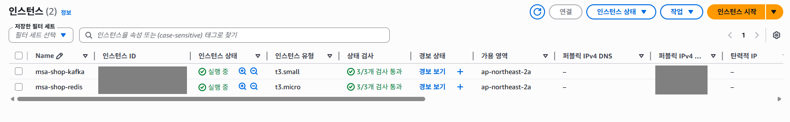
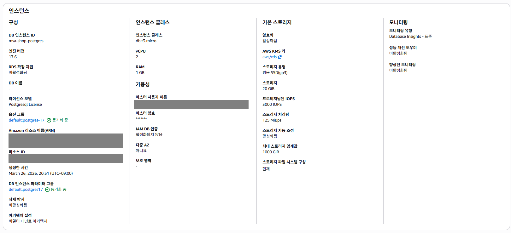
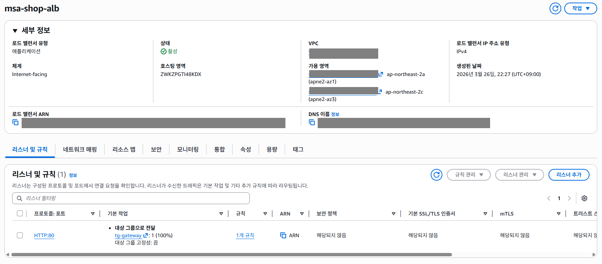

# Kafka 기반 Spring Boot MSA를 AWS에 어떤 구조로 배포했는지 정리

이번 글은 AWS 콘솔 사용법을 단계별로 따라가는 글은 아니다.  
대신 내가 만든 Spring Boot 기반 MSA 프로젝트를 실제로 AWS에 배포하면서, 어떤 기준으로 리소스를 나누고 어떤 구조로 배치했는지를 먼저 정리해보려는 글이다.

이 프로젝트는 단순히 서비스를 여러 개로 쪼개는 데 목적이 있지 않았다.  
주문, 재고, 결제, 회원, 인증이 얽힌 흐름을 실제로 분리된 서비스 위에서 운영하려면 다음 질문에 답할 수 있어야 했다.

- 외부 요청은 어디에서 받아야 하는가
- 애플리케이션 서비스는 어디까지 외부에 노출해야 하는가
- 서비스 간 통신은 어디까지 동기 호출로 두고, 어디부터 이벤트로 넘길 것인가
- AWS에서는 이 경계를 어떤 리소스로 표현할 것인가

이번 글에서는 그 결과로 정리한 전체 배포 구조를 먼저 설명한다.

## 서비스 구성

프로젝트는 아래 여섯 개 서비스로 나누었다.

- `gateway`
- `auth-service`
- `user-service`
- `product-service`
- `order-service`
- `payment-service`

역할은 대략 이렇게 나뉜다.

- `gateway`: 외부 요청 진입, JWT 검증, 내부 서비스 라우팅
- `auth-service`: 로그인, 토큰 발급, 인증 정보 관리
- `user-service`: 사용자 프로필과 상태 관리
- `product-service`: 상품과 재고 관리
- `order-service`: 주문 생성과 주문 상태 관리
- `payment-service`: 결제 요청과 결제 결과 처리

즉 이번 구조의 핵심은 단순한 서비스 분할이 아니라, 서비스마다 책임과 데이터 경계를 분리하는 데 있다.

## 전체 AWS 구조

먼저 이번 배포 구조를 한 장으로 요약하면 아래와 같다.

이 그림은 세부 통신을 모두 표현한 그림이라기보다, **어떤 리소스를 어디에 배치했고 각 리소스가 어떤 역할을 맡는지**를 요약한 구조도라고 보면 된다.

실제 AWS에서는 아래처럼 6개 서비스가 ECS Fargate로 올라가 있는 상태를 확인할 수 있었다.

_gateway를 포함한 6개 서비스를 ECS Fargate로 배포해 실제로 실행되는 상태를 확인했다._

큰 흐름은 단순하다.

- 외부 요청은 `ALB` 하나로만 받는다
- 실제 애플리케이션 서비스는 `ECS Fargate`로 실행한다
- 애플리케이션 서비스는 `private app subnet` 안에 둔다
- 데이터는 `RDS PostgreSQL`에 저장한다
- 이벤트 기반 비동기 흐름은 `Kafka`로 처리한다
- 일부 서비스 설정과 캐시성 용도는 `Redis`를 사용한다
- private subnet의 ECS가 바깥으로 나가야 할 때는 `NAT Gateway`를 사용한다

## 서브넷을 세 영역으로 나눈 이유

이번 배포에서는 하나의 `VPC`를 만든 뒤, 그 안을 아래 세 영역으로 나누었다.

- `public subnet`
- `private app subnet`
- `private data subnet`

이렇게 나눈 이유는 단순하다.  
외부에 보여야 하는 리소스와, 내부에서만 동작해야 하는 리소스를 물리적으로 분리하기 위해서다.

### public subnet

public subnet에는 외부와 직접 연결되거나, private subnet 리소스의 outbound를 대신 처리해야 하는 리소스를 배치했다.

- `ALB`
- `NAT Gateway`
- `Kafka EC2`
- `Redis EC2`

여기서 `ALB`는 외부 요청이 처음 들어오는 진입점이고, `NAT Gateway`는 private subnet 안에 있는 ECS task가 바깥으로 나갈 때 사용하는 출구다.

Kafka와 Redis를 public subnet에 둔 것은 운영형 정답에 가깝다기보다는, 이번 포트폴리오 범위에서 관리형 서비스까지 확장하기보다 **EC2 + Docker 조합으로 빠르게 구조를 검증**하려는 선택에 가깝다.  
대신 보안 그룹을 통해 Kafka와 Redis 포트는 ECS 쪽에서만 접근 가능하도록 제한했다.

아래는 Kafka와 Redis를 올린 EC2 인스턴스 목록이다.

_Kafka와 Redis는 관리형 서비스 대신 EC2 위에 직접 구성했다._

### private app subnet

private app subnet에는 실제 애플리케이션 서비스가 올라간다.

- `gateway`
- `auth-service`
- `user-service`
- `product-service`
- `order-service`
- `payment-service`

이 서비스들은 모두 `ECS Fargate` task로 실행했다.  
즉 EC2에 직접 컨테이너를 올린 것이 아니라, AWS가 관리하는 컨테이너 실행 환경 위에서 서비스만 배포하는 방식이다.

여기서 `Fargate`는 쉽게 말해 **서버를 직접 관리하지 않고 컨테이너만 실행하는 방식**이다.  
컨테이너를 어떤 이미지로 띄울지, CPU와 메모리를 얼마나 줄지만 정의하면 실제 실행 환경은 AWS가 준비한다.

이 계층을 private subnet에 둔 이유는 분명하다.  
애플리케이션은 AWS 안에서 동작하지만, 외부에서 각 서비스에 직접 접근할 수 없게 만들고 싶었기 때문이다.  
외부 요청은 반드시 `ALB -> gateway`를 거치고, gateway가 내부 서비스로 요청을 넘긴다.

### private data subnet

private data subnet에는 데이터 저장 계층을 배치했다.

- `RDS PostgreSQL`

이번 프로젝트에서는 서비스마다 RDS 인스턴스를 따로 만들지 않고, PostgreSQL 인스턴스 하나 안에 아래처럼 서비스별 DB를 분리했다.

- `auth_db`
- `user_db`
- `product_db`
- `order_db`
- `payment_db`

물리적으로는 하나의 RDS를 쓰지만, 논리적으로는 서비스별 데이터 소유권을 유지하는 방향이다.  
포트폴리오 범위에서 비용을 통제하면서도, 서비스별 데이터 경계를 완전히 무시하지 않기 위한 타협이었다.

아래는 실제로 사용한 PostgreSQL RDS 인스턴스 화면이다.

_데이터 계층은 별도 RDS PostgreSQL 인스턴스로 분리했다._

## 외부 요청은 어떻게 들어오고, 응답은 어떻게 돌아가는가

외부 사용자는 내부 서비스들을 직접 보지 않는다.  
사용자가 보는 것은 `ALB` 하나뿐이다.

요청 흐름은 다음과 같다.

1. 클라이언트가 ALB로 요청을 보낸다
2. ALB가 요청을 `gateway`로 전달한다
3. `gateway`가 JWT를 검증하고 라우팅을 결정한다
4. 내부 서비스가 실제 비즈니스 처리를 수행한다
5. 응답은 다시 `gateway -> ALB -> 클라이언트` 순서로 돌아간다

ALB는 실제로 아래처럼 gateway를 바라보도록 구성했다.

_외부 요청은 ALB를 통해서만 들어오도록 구성했다._

그리고 gateway target은 healthy 상태가 되는 것을 확인했다.

_gateway를 ALB 뒤에 연결하고 target group이 healthy 상태가 되는 것까지 확인했다._

즉 외부 기준으로는 하나의 진입점만 공개하고, 실제 서비스들은 private subnet 안에 숨기는 구조다.

## Service Connect는 어떤 역할을 하나

이번 구성에서 내부 서비스 간 통신은 `Service Connect`를 사용했다.

이 기능은 ECS 바깥의 별도 서비스라기보다, **ECS 안에 올라간 서비스들이 서로를 이름으로 찾을 수 있게 해주는 내부 기능**에 가깝다.

예를 들어 gateway는 내부 서비스의 실제 IP를 몰라도 된다.  
대신 `auth-service`, `product-service` 같은 이름으로 요청을 보낼 수 있고, ECS 내부에서 그 이름을 실제 서비스로 연결해준다.

이 방식을 택한 이유는 분명하다.

- 서비스가 재배포되더라도 개별 IP를 신경 쓰지 않아도 된다
- task가 바뀌어도 서비스 이름 기준으로 연결할 수 있다
- Docker Compose 시절의 서비스 이름 기반 통신과 개념적으로 이어진다

즉 gateway와 내부 서비스 간 통신을 AWS에서도 비교적 일관된 방식으로 유지할 수 있었다.

## Kafka는 어디에 쓰고, 어디까지 이벤트로 넘겼는가

이번 구조에서 모든 서비스 간 통신을 Kafka로 처리한 것은 아니다.  
읽기성 조회나 즉시 응답이 필요한 일부 내부 호출은 여전히 HTTP 기반으로 두었다.

대신 다음처럼 여러 서비스의 상태가 함께 바뀌는 흐름은 Kafka 기반 이벤트 처리로 넘겼다.

- 주문 생성 이후의 후속 처리
- 재고 예약과 확정/해제
- 결제 요청과 결제 결과 반영

즉 이번 구조는 “모든 것을 이벤트 기반으로 바꾼 구조”가 아니라, **강하게 결합된 긴 비즈니스 흐름만 Kafka saga로 처리하는 구조**에 가깝다.

이렇게 한 이유는 단순하다.

- 읽기 조회까지 모두 이벤트로 넘기면 구조만 복잡해진다
- 반대로 주문/재고/결제처럼 여러 서비스 상태가 얽힌 흐름은 동기식으로 묶을수록 실패 지점이 애매해진다

결과적으로 이번 프로젝트에서는 동기 HTTP와 비동기 이벤트를 섞되, 액션의 성격에 따라 통신 방식을 나누는 쪽을 선택했다.

## NAT Gateway는 왜 필요했나

이번 배포에서 가장 헷갈렸던 부분 중 하나가 NAT였다.

private app subnet에 있는 ECS 서비스는 외부에서 직접 들어오면 안 된다.  
하지만 그렇다고 해서 바깥과 완전히 단절되어도 안 된다.  
예를 들어 ECS task는 다음 작업을 해야 한다.

- `ECR`에서 이미지를 pull
- `CloudWatch Logs`로 로그 전송

여기서 중요한 점은 **보안 그룹 아웃바운드를 열어두는 것만으로는 부족하다**는 것이다.  
보안 그룹은 통신을 허용할지 말지만 결정하고, 실제로 패킷이 어디로 나갈지는 route table과 NAT/IGW가 결정한다.

그래서 이번 구조에서는:

- `NAT Gateway`를 public subnet에 두고
- `private app subnet`의 기본 경로를 NAT Gateway로 연결했다

이렇게 하면 private subnet 안의 ECS task는 외부에서 직접 접근되지는 않지만, 필요한 outbound 통신은 NAT를 통해 수행할 수 있다.

즉 NAT는 외부 요청을 받는 입구가 아니라, **private 리소스가 바깥으로 나갈 때 사용하는 출구**라고 이해하는 편이 맞다.

## 이번 구조에서 의도적으로 타협한 부분

이번 구조가 운영 기준의 완전한 정답이라고 보긴 어렵다.  
대신 포트폴리오 목적에서 “어떤 구조를 왜 선택했는지”를 설명할 수 있는 수준으로 현실적인 타협을 했다.

대표적인 예시는 아래와 같다.

- Kafka와 Redis는 관리형 서비스 대신 EC2 + Docker로 구성
- RDS는 서비스별 인스턴스가 아니라 하나의 PostgreSQL 인스턴스에 DB를 분리
- 애플리케이션 서비스는 private subnet에 두되, outbound는 NAT로 해결
- 내부 서비스 이름 기반 통신은 Service Connect로 정리

즉 이번 배포는 운영 최적화보다, **MSA를 AWS 위에서 실제로 배치하고 검증할 수 있는 구조를 만들었다는 점**에 더 가깝다.

## 마무리

이번 글에서는 Spring Boot 기반 MSA 프로젝트를 AWS에서 어떤 구조로 배포했는지 먼저 정리했다.

핵심만 다시 요약하면 다음과 같다.

- 외부 요청은 ALB 하나로만 받는다
- gateway가 인증과 라우팅을 담당한다
- 실제 애플리케이션 서비스는 ECS Fargate로 private subnet에서 실행한다
- 데이터는 private data subnet의 RDS PostgreSQL에 저장한다
- Kafka는 긴 비즈니스 흐름을 이벤트 기반으로 연결하는 데 사용한다
- Redis는 일부 서비스에서만 보조적으로 사용한다
- private ECS의 outbound는 NAT Gateway를 통해 처리한다

다음 글에서는 이 구조 위에서 실제로 이미지를 ECR에 올리고, ECS Fargate 서비스와 ALB를 연결하면서 겪었던 시행착오와 배포 트러블슈팅을 정리해보려 한다.
