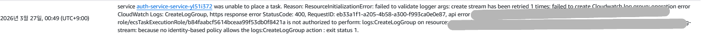
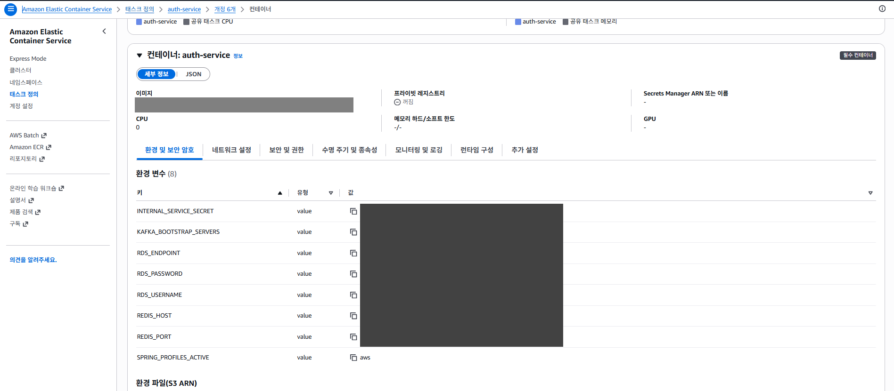
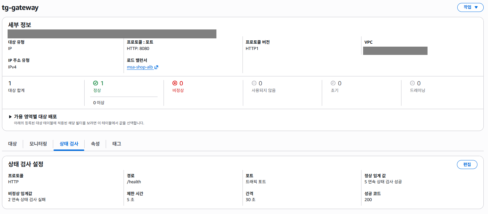
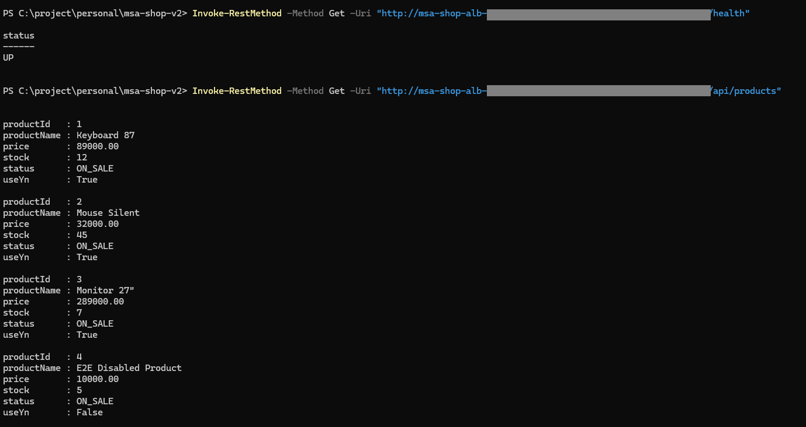

# Spring Boot MSA를 AWS ECS/Fargate로 배포하며 겪은 시행착오 정리

1편에서는 이 프로젝트를 AWS에서 어떤 구조로 배치했는지 정리했다.  
이번 글에서는 그 구조를 실제로 AWS에 올리면서 어떤 순서로 배포를 진행했고, 어디에서 막혔고, 어떤 방식으로 정리했는지를 기록해보려 한다.

이번 배포의 목표는 단순히 컨테이너를 띄우는 것이 아니었다.  
로컬 Docker Compose에서 동작하던 구조를 AWS에서도 비슷한 책임 분리로 옮기고, 다음 조건을 만족하는지 확인하는 것이 목적이었다.

- 외부 요청은 ALB와 gateway를 통해서만 들어올 것
- 내부 서비스는 ECS Fargate로 private subnet에서 동작할 것
- 데이터는 RDS PostgreSQL로 옮길 것
- Kafka와 Redis는 EC2 위에서 별도로 구성할 것
- 서비스 간 이름 기반 통신은 Service Connect로 연결할 것

## 배포 순서

실제 진행 순서는 아래와 같았다.

1. 서비스 이미지를 빌드해서 `ECR`에 push
2. `RDS PostgreSQL` 생성
3. `Kafka EC2`, `Redis EC2` 생성
4. 각 서비스의 `Task Definition` 작성
5. `Service Connect` namespace 생성
6. 내부 서비스(`auth`, `user`, `product`, `order`, `payment`)를 먼저 ECS Service로 배포
7. 마지막에 `gateway`를 ALB와 연결

겉으로 보면 단순한 순서 같지만, 실제로는 중간에 환경변수 구조와 네트워크 경로, 로그 설정 때문에 여러 번 배포를 다시 해야 했다.

## 이미지 배포와 ECS 서비스 생성

애플리케이션 서비스는 모두 Docker 이미지로 빌드해서 ECR에 올렸다.  
이후 ECS에서는 각 서비스별 `Task Definition`을 만들고, 이를 기반으로 `Service`를 생성했다.

내부 서비스들은 공통적으로 아래 조건으로 배포했다.

- 실행 환경: `ECS Fargate`
- 배치 위치: `private app subnet`
- 보안 그룹: `sg-ecs`
- 외부 공개: 없음
- 서비스 간 통신: `Service Connect`

이때 `gateway`만 예외적으로 ALB와 연결했고, 나머지 서비스들은 외부에 직접 노출하지 않았다.

## 처음 막혔던 지점: private subnet과 outbound 경로

가장 먼저 부딪힌 문제는 **private subnet에 올린 ECS task가 정상적으로 뜨지 않는 문제**였다.

처음에는 보안 그룹 아웃바운드를 열어두었기 때문에 외부 통신도 괜찮을 것이라고 막연히 생각했다.  
하지만 실제로는 보안 그룹만 열려 있다고 해서 외부로 나갈 수 있는 것은 아니었다.

여기서 정리된 핵심은 아래와 같다.

- 보안 그룹: 통신을 허용할지 말지를 결정
- Route Table: 실제 패킷을 어디로 보낼지 결정
- NAT Gateway: private subnet 리소스의 outbound 출구

즉 ECS task를 private subnet에 두는 순간, 단순히 public IP를 없애는 것으로 끝나는 것이 아니라 **ECR 이미지 pull, CloudWatch Logs 전송 같은 outbound 경로를 별도로 열어줘야 했다.**

이를 해결하기 위해:

- `NAT Gateway`를 public subnet에 생성하고
- `private app subnet`의 route table 기본 경로를 NAT Gateway로 연결했다

이후부터는 private subnet 안의 ECS task도 ECR과 CloudWatch에 접근할 수 있게 되었다.

## CloudWatch Logs 설정 문제

다음으로 꽤 오래 잡고 있었던 문제는 `CloudWatch Logs`였다.

처음에는 ECS task가 뜨기 전에 로그 관련 에러로 멈추는 경우가 있었다.  
특히 로그 그룹 이름이 다르거나, ECS가 실제로 생성하려는 로그 그룹과 내가 생각한 로그 그룹이 다를 때 task 초기화 단계에서부터 꼬일 수 있었다.

아래처럼 서비스 이벤트와 로그 에러를 통해 문제를 좁혀갔다.

_초기에는 CloudWatch Logs 설정 불일치 때문에 task가 초기화 단계에서 실패했다._

여기서 알게 된 점은 두 가지였다.

첫째, ECS task definition에 넣은 로그 그룹 이름과 실제로 ECS가 생성하려는 로그 그룹 이름이 다르면 task 초기화 단계에서부터 꼬일 수 있다는 점이다.  
둘째, 애플리케이션 로그와 Service Connect 관련 로그는 구분해서 봐야 한다는 점이다.

결국 이 문제는:

- 로그 그룹 이름을 고정해서 다시 맞추고
- ECS가 실제로 바라보는 로그 그룹과 일치시키는 방식으로 정리했다

이후부터는 CloudWatch에서 애플리케이션 로그를 보기 훨씬 수월해졌다.

## RDS와 데이터베이스 초기화 문제

다음으로 막혔던 것은 `RDS`였다.

RDS 인스턴스를 만든 뒤 바로 서비스들이 붙을 것이라고 생각했지만, 실제로는 아래 두 가지를 먼저 정리해야 했다.

- 서비스별 데이터베이스 생성
- 애플리케이션 환경변수 정리

이번 프로젝트는 PostgreSQL 인스턴스 하나를 두고 그 안에 다음 DB를 따로 만들었다.

- `auth_db`
- `user_db`
- `product_db`
- `order_db`
- `payment_db`

즉 RDS를 만든 것만으로는 충분하지 않았고, 애플리케이션이 실제로 사용할 DB를 추가로 생성해야 했다.

또한 AWS 환경으로 옮기면서 `RDS_ENDPOINT` 같은 환경변수를 처음에는 JDBC URL 전체로 넣는 실수를 했다.  
그 결과 애플리케이션에서 URL이 중복 합성되는 문제가 생겼고, Flyway와 JPA 초기화 단계에서 실패했다.

이 과정에서 정리된 기준은 단순했다.

- `RDS_ENDPOINT`에는 호스트명만 넣는다
- 실제 JDBC URL은 애플리케이션 설정에서 조합한다
- 서비스별 DB 이름은 `application-aws.yml`에 고정한다

## 애플리케이션 프로필 정리의 필요성

배포를 진행하면서 가장 크게 느낀 점 중 하나는 **로컬용 프로필과 AWS용 프로필을 섞어 쓰면 결국 설정이 무너진다**는 점이었다.

처음에는 `local`, `docker`, `saga-e2e` 조합에 환경변수를 계속 덧붙이는 식으로 밀어붙였다. 이후 `local`, `aws` 두 케이스로 단순화하고, 로컬 기능은 `local` 프로필 기본값으로 통합했다.  
하지만 이 방식은 금방 한계를 드러냈다.

- 포트는 어느 프로필에 있는가
- 내부 호출 주소는 어느 설정을 따르는가
- AWS에서 필요한 endpoint override는 어디에 두는가

결국 서비스별로 `application-aws.yml`을 추가해서 AWS 배포 설정을 별도 프로필로 분리했다.  
이후부터는 ECS 환경변수도 단순해졌다.

아래는 실제로 task definition에서 AWS용 환경변수를 정리한 화면이다.

_AWS 배포용 설정은 별도 프로필로 분리하고, ECS에서는 최소 환경변수만 주입하도록 정리했다._

예를 들어 서비스별 공통적으로 필요한 값은 아래 정도로 정리할 수 있었다.

- `SPRING_PROFILES_ACTIVE=aws`
- `RDS_ENDPOINT`
- `RDS_USERNAME`
- `RDS_PASSWORD`
- `KAFKA_BOOTSTRAP_SERVERS`
- `REDIS_HOST`
- `REDIS_PORT`
- `INTERNAL_SERVICE_SECRET`

이렇게 분리하고 나니, 로컬 실행 설정과 AWS 배포 설정의 책임이 확실히 나뉘었다.

## gateway health check 추가

마지막으로 `gateway`는 ALB에 연결되기 때문에 health check가 반드시 필요했다.

초기에는 별도 health endpoint가 없어서 ALB target group health check가 계속 실패했고, 그 결과 gateway task가 안정적으로 유지되지 않았다.

이 문제는 간단하게:

- `GET /health` 엔드포인트를 추가하고
- 해당 경로는 인증 없이 접근 가능하게 열어두고
- ALB target group health check path를 `/health`로 맞추는 방식으로 해결했다

아래는 health check 경로를 맞춘 뒤 target group 상태를 확인한 화면이다.

_별도 health endpoint가 없으면 ALB가 gateway 상태를 정상적으로 판단할 수 없었고, `/health`를 추가한 뒤 상태를 안정적으로 확인할 수 있었다._

## 배포 과정에서 같이 정리한 코드

AWS 배포를 맞추는 과정에서 단순 환경변수 수정만 있었던 것은 아니다.  
프로젝트 내부 구조도 일부 정리했다.

대표적으로 아래 두 가지를 손봤다.

### 1. AWS 전용 설정 추가

각 서비스에 `application-aws.yml`을 추가해서 AWS 배포 설정을 별도 분리했다.

### 2. 더 이상 쓰지 않는 직접 호출 경로 정리

order-service에서 product-service로 직접 재고 차감을 호출하던 예전 경로는 현재 saga 구조 기준으로 더 이상 메인 플로우가 아니었기 때문에 제거했다.  
반면 일부 내부 HTTP 호출은 아직 실제 사용 중이어서 유지했다.

즉 이번 정리는 단순히 “배포가 되게 만들기 위한 임시 수정”이 아니라, 현재 구조 기준으로 의미가 애매한 경로를 같이 걷어내는 작업이기도 했다.

## 최종적으로 정리된 구조

결국 이번 배포 과정을 거치면서 구조는 아래처럼 정리되었다.

- `ALB`는 외부 요청의 단일 진입점
- `gateway`는 인증과 라우팅 담당
- 내부 서비스는 `ECS Fargate`로 private subnet에서 실행
- 서비스 간 내부 이름 기반 통신은 `Service Connect` 사용
- 데이터는 `RDS PostgreSQL`
- 이벤트 기반 흐름은 `Kafka`
- 일부 서비스는 `Redis` 사용
- private ECS의 outbound는 `NAT Gateway`를 통해 처리
- AWS 배포 설정은 `application-aws.yml`로 별도 분리

즉 처음에는 단순히 “AWS에 올리는 것”이 목표였지만, 실제로는 배포 과정 자체가 **설정 책임을 정리하고, 오래된 경로를 걷어내고, 운영 관점에서 구조를 다시 점검하는 과정**이 되었다.

## 구축 과정 요약

여기까지가 메인 내용이고, 실제로 콘솔에서 어떤 것을 만들었는지는 아래 정도 순서로 요약할 수 있다.

1. VPC, Subnet, Route Table, Internet Gateway 생성
2. NAT Gateway 생성 후 private app subnet route 연결
3. RDS PostgreSQL 생성
4. Kafka EC2, Redis EC2 생성 후 Docker로 기동
5. ECR repository 생성 후 이미지 push
6. ECS Task Definition 작성
7. Service Connect namespace 생성
8. 내부 서비스 ECS Service 생성
9. gateway ECS Service 생성 및 ALB 연결
10. CloudWatch Logs, health check, 환경변수 정리

이 부분은 블로그 마지막에 스크린샷 몇 장과 함께 짧게 부록처럼 붙이면 충분하다고 생각한다.  
핵심은 콘솔 클릭 순서보다, 왜 그렇게 구성했고 어디서 막혔는지를 설명하는 쪽에 있기 때문이다.

## 마무리

이번 배포를 통해 가장 크게 느낀 점은, AWS 배포는 단순히 애플리케이션 이미지를 올리는 작업이 아니라는 것이다.

실제로는 아래와 같은 질문에 계속 답해야 했다.

- 이 서비스는 외부에 보여야 하는가
- private subnet에 둘 경우 outbound는 어떻게 열 것인가
- 로그는 어디에 쌓이고, 어디서 확인할 것인가
- 로컬용 설정과 배포용 설정은 어떻게 분리할 것인가
- 현재 코드 구조에서 정말 필요한 호출만 남아 있는가

즉 이번 작업은 배포 그 자체보다도, **프로젝트 구조를 운영 가능한 형태로 다시 바라보는 과정**에 더 가까웠다.

마지막으로 실제 배포 환경에서 `/health`와 상품 조회가 정상적으로 동작하는 것까지 확인했다.

_최종적으로는 ALB를 통해 gateway와 내부 서비스가 연결되고, 실제 API 호출까지 성공하는 상태를 확인했다._
