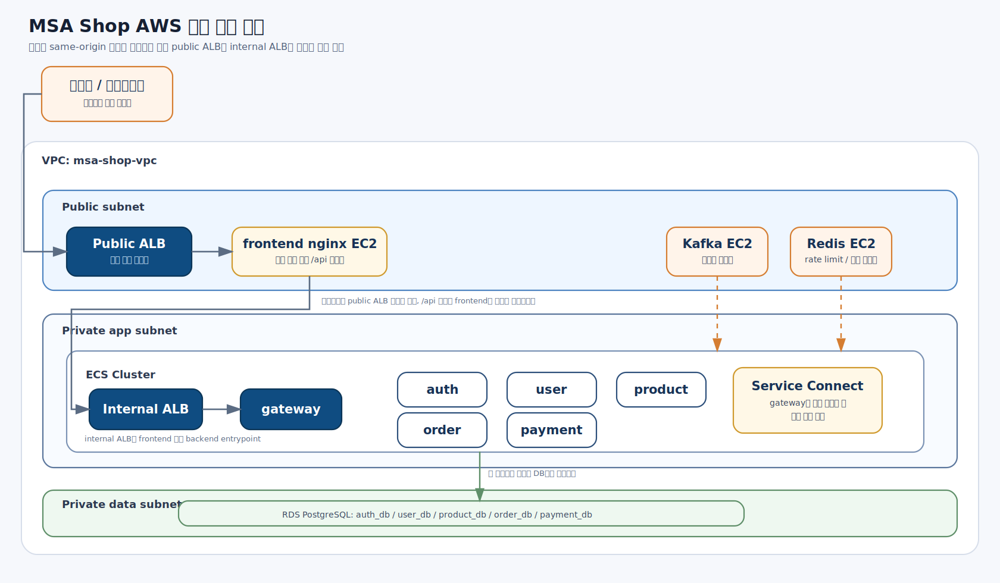
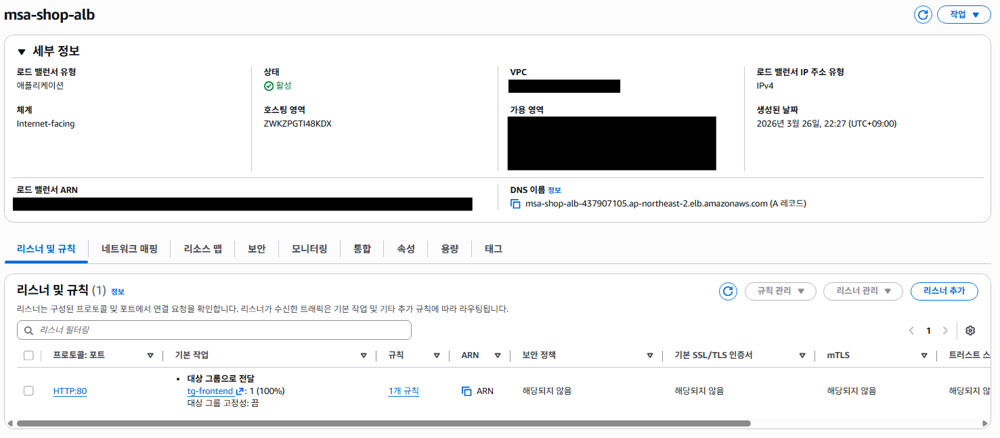
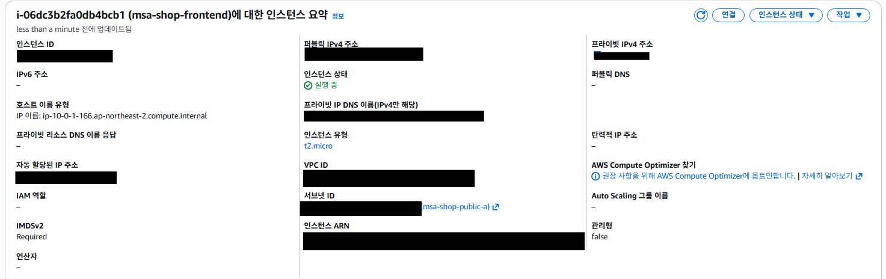
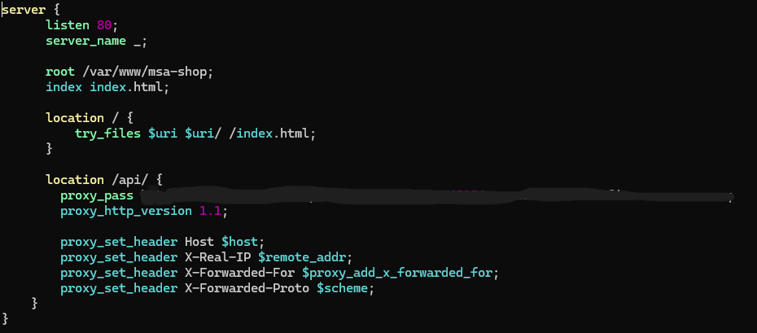
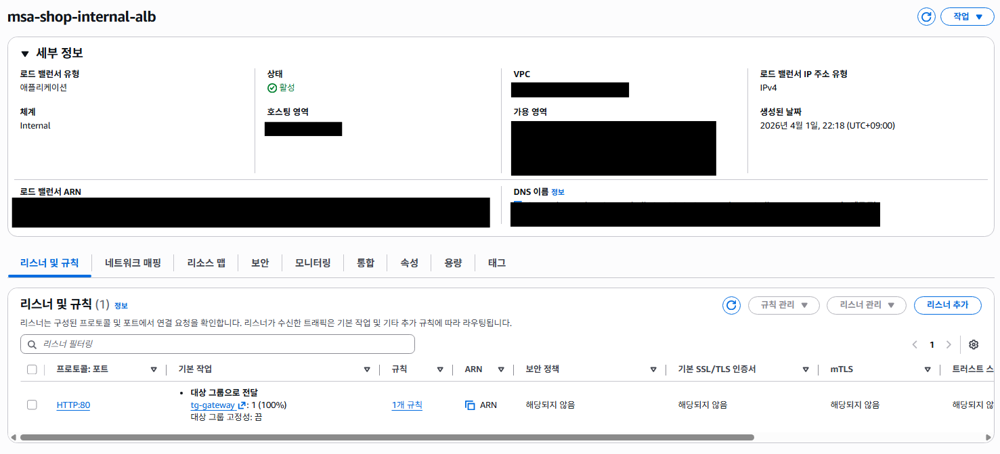
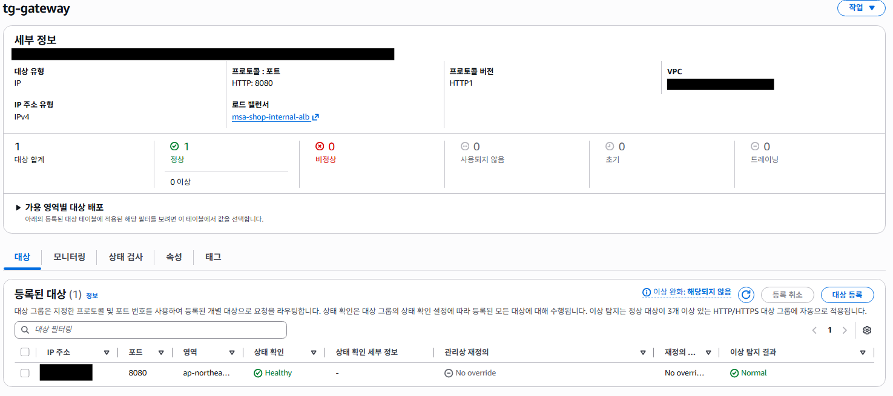
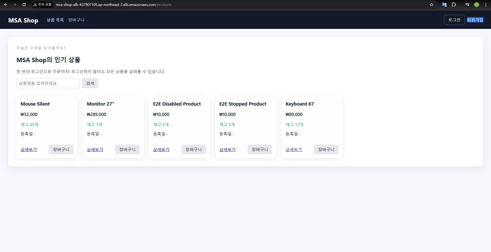
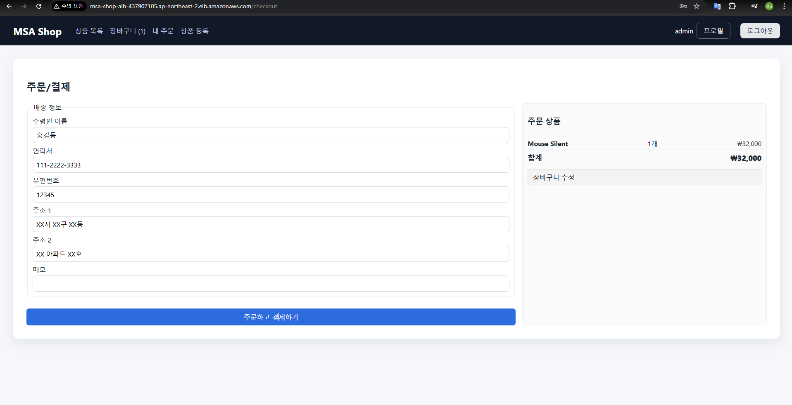
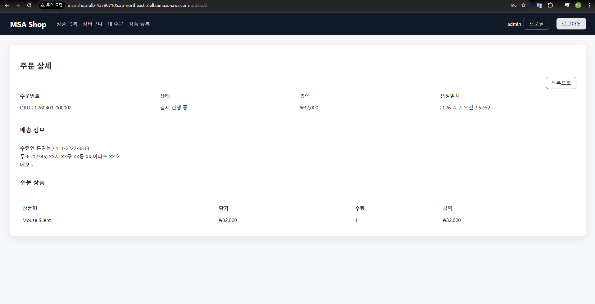
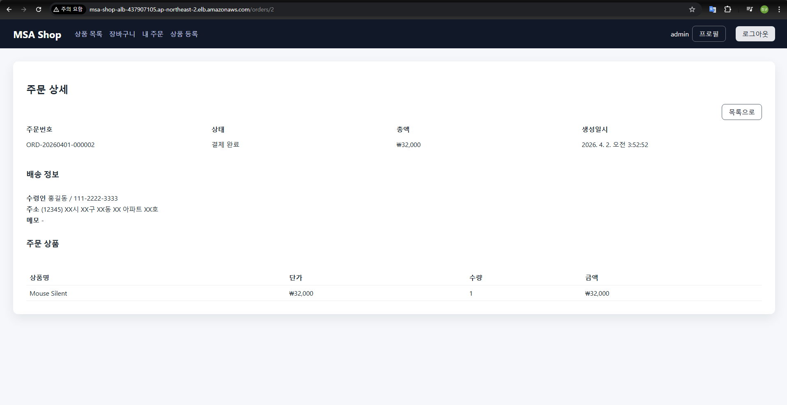

# 프런트엔드까지 연결하면서 정리한 AWS 최종 배포 구조

1편과 2편에서는 Spring Boot 기반 MSA를 AWS에 배포하면서 백엔드 중심 구조를 먼저 정리했다.  
이번 글에서는 그 위에 프런트엔드를 실제로 연결하면서 최종적으로 어떤 구조를 선택했는지, 그리고 그 과정에서 어떤 시행착오를 거쳤는지를 정리한다.

이번 단계의 핵심은 단순히 정적 파일을 하나 올리는 것이 아니었다.  
이미 `ALB -> gateway -> backend services` 구조가 잡혀 있는 상태에서, 프런트엔드를 어디에 두고 어떤 방식으로 API와 연결할지 결정해야 했다.

이번 과정에서 실제로 고민했던 질문은 아래와 같았다.

- 프런트는 AWS 어디에서 서빙할 것인가
- API는 기존 public ALB를 그대로 사용할 것인가
- 브라우저 기준으로 same-origin 구조를 유지할 것인가
- 프런트에서 `/api`를 어디로 프록시해야 하는가
- public ALB와 backend 진입점을 어떻게 분리해야 하는가

결론부터 말하면 최종 구조는 아래와 같다.

- public ALB
- frontend nginx EC2
- internal ALB
- gateway ECS
- backend ECS services

즉 사용자 요청은 public ALB로 들어오고, 프런트 정적 파일은 nginx가 응답한다.  
그리고 nginx는 `/api` 요청만 internal ALB로 프록시하고, internal ALB가 다시 gateway ECS로 요청을 전달하는 구조로 정리했다.

## 왜 Amplify가 아니라 nginx EC2로 갔는가

처음에는 Amplify Hosting 같은 정적 호스팅도 고려했다.  
정적 프런트를 올리는 것 자체는 Amplify가 더 간단하고, HTTPS 기본 제공 측면에서도 편한 선택지였다.

하지만 이번 배포는 포트폴리오 확인용 임시 배포에 가까웠고, 아래 조건이 같이 있었다.

- API는 기존 HTTP 기반 ALB에 먼저 올라가 있었음
- 별도 커스텀 도메인과 인증서를 추가로 붙일 계획은 없었음
- 프런트와 백엔드 쿠키/인증 흐름까지 같이 확인해야 했음

이 조건에서 Amplify를 쓰면 프런트는 HTTPS, 백엔드는 HTTP가 되어 mixed content와 쿠키 정책 문제가 바로 생긴다.  
특히 refresh token 쿠키는 `Secure`, `SameSite` 설정과 직접 연결되기 때문에, 프런트와 API origin이 갈라지는 구조를 가볍게 넘기기 어려웠다.

반면 nginx EC2로 프런트를 직접 서빙하면 브라우저 기준으로 `/api` 상대경로를 그대로 유지할 수 있다.

- 프런트: `/`
- API: `/api`

즉 프런트 코드의 `VITE_API_BASE=/api`를 그대로 유지한 채, 프록시만 서버에서 처리할 수 있다.  
이번 단계에서는 이 단순함이 훨씬 중요했다.

## public ALB와 frontend nginx를 먼저 연결

먼저 public ALB를 프런트 진입점으로 쓰고, frontend nginx EC2를 target으로 연결했다.  
외부 사용자는 public ALB 하나만 보고, 실제 프런트 정적 파일은 nginx가 응답하는 구조다.

그리고 프런트는 별도 EC2에 nginx를 올려서 서빙했다.

nginx의 책임은 두 가지뿐이다.

1. Vue/Vite 빌드 결과물(`dist`)을 정적으로 서빙
2. `/api` 요청만 backend로 프록시

핵심 설정은 아래 방향이었다.

- `location /`
  - `index.html` fallback
  - SPA 라우팅 대응
- `location /api/`
  - backend 진입점으로 프록시

다만 여기서 바로 public ALB를 `/api` 프록시 대상으로 쓰면 문제가 생겼다.

## 처음 떠올린 구조와 실제로 막힌 지점

처음에는 public ALB 하나로 아래처럼 모두 처리하려고 했다.

- `/*` -> frontend nginx
- `/api/*` -> gateway

겉으로 보면 자연스럽다.  
사용자는 ALB 하나만 보고, frontend는 ALB 뒤에 있고, backend도 ALB 뒤에 있다.

문제는 nginx에서 `/api`를 어디로 보낼지였다.  
nginx가 `/api`를 다시 같은 public ALB로 보내면, 아래와 같은 구조가 된다.

- 브라우저
- public ALB
- frontend nginx
- nginx `/api` 프록시
- 다시 public ALB

이건 설정이 조금만 어긋나도 프록시 루프가 생긴다.  
실제로 이 상태에서 `463` 응답이 발생했다.

즉 구조적으로는

- `ALB -> frontend -> gateway`

를 원했지만, 실제 프록시 대상은

- `frontend -> 같은 public ALB`

가 되어버렸고, 그 결과 loop가 생긴 것이다.

이 에러를 통해 확인한 건 명확했다.

- frontend가 backend로 들어갈 때는 public ALB를 다시 보면 안 된다
- backend 전용 내부 진입점이 따로 있어야 한다

## 왜 internal ALB를 추가했는가

이 문제를 해결하려면 frontend가 `/api`를 보낼 별도의 backend 진입점이 필요했다.

즉 public 사용자 트래픽을 받는 진입점과, frontend가 backend로 들어가는 내부 진입점을 분리해야 했다.

그래서 최종적으로 아래 구조를 만들었다.

- public ALB
  - frontend nginx로 라우팅
- internal ALB
  - gateway ECS로만 라우팅
- nginx
  - `/`는 정적 파일 응답
  - `/api`는 internal ALB로 프록시

이렇게 두 단계로 나누면 프록시 흐름이 명확해진다.

- 사용자 -> public ALB -> frontend
- frontend -> internal ALB -> gateway -> backend services

이 구조에서는 public ALB와 internal ALB의 책임이 다르다.

- public ALB: 외부 진입점
- internal ALB: frontend에서 backend로 들어가는 내부 진입점

즉 internal ALB를 둔 이유는 단순한 리소스 추가가 아니라, **프런트와 백엔드 사이의 프록시 경로를 구조적으로 분리하기 위해서**였다.

그리고 internal ALB가 gateway ECS를 정상적으로 바라보는지 target group 상태까지 확인했다.

## 504 에러: internal ALB를 만들고도 바로 되지 않았던 이유

internal ALB를 추가한 뒤에는 loop는 없어졌지만, 이번에는 `504 Gateway Time-out`이 발생했다.

이때는 frontend에서 internal ALB까지는 도달했지만, internal ALB에서 gateway target으로 넘어가지 못하는 상태였다.

결과적으로 확인된 원인은 gateway 쪽 기동 상태 문제였다.  
즉 프록시 경로는 맞게 잡혔지만, 최종적으로 응답해야 할 gateway task가 정상적으로 떠 있지 않은 상태였다.

이 과정에서 다시 정리하게 된 체크포인트는 아래와 같았다.

- internal target group health 상태
- internal ALB security group
- gateway ECS security group
- gateway target group 포트와 health check path
- ECS service가 internal target group에 실제로 등록되었는지
- gateway task가 실제로 정상 기동 중인지

즉 `504`는 무조건 네트워크 문제라고 보기보다,  
`frontend -> internal ALB -> gateway` 경로 중 어디까지 정상인지 단계별로 끊어서 봐야 했다.

## same-origin 구조를 유지하면서 얻은 이점

최종적으로는 브라우저 기준으로 same-origin 구조를 유지하게 되었다.

즉 사용자는 하나의 진입점만 본다.

- `http://<public-entry>/`

이 경로에서 프런트와 API가 모두 연결된다.

이 방식의 장점은 아래와 같았다.

- 프런트에서 `VITE_API_BASE=/api`를 그대로 유지 가능
- CORS 이슈를 거의 신경 쓰지 않아도 됨
- refresh token 쿠키 처리도 상대적으로 단순함
- 프런트와 API를 다른 도메인으로 분리했을 때 생기는 mixed content 문제를 피할 수 있음

실제로 배포 후 상품 목록 화면까지 정상 확인할 수 있었다.

즉 이번 배포에서는 HTTPS와 도메인까지 정교하게 맞춘 운영 구조보다,  
**프런트와 백엔드 전체 흐름을 안정적으로 검증할 수 있는 단순한 구조**가 더 중요했다.

## auth 쿠키 설정을 다시 정리한 이유

프런트 배포 방식을 두고 Amplify와 nginx를 모두 검토하다 보니, auth-service의 쿠키 설정도 한 번 정리할 필요가 있었다.

프런트와 API가 서로 다른 origin이 되는 구조에서는 보통 아래 조합이 필요하다.

- `Secure=true`
- `SameSite=None`

하지만 이번에 최종적으로 선택한 구조는 same-origin 기반 nginx 프록시 구조였다.  
즉 프런트와 API를 브라우저가 다른 사이트로 인식하지 않는다.

그래서 AWS 배포 설정에서는 auth 쿠키를 아래처럼 다시 맞췄다.

- `secure=false`
- `same-site=Lax`

즉 이 설정 변경도 단순한 옵션 수정이 아니라, **최종 배포 구조가 same-origin이냐 cross-origin이냐에 따라 인증 정책이 달라진 결과**였다.

## local seed admin 계정이 배포 환경에는 없었던 문제

프런트를 붙이고 실제 로그인까지 확인하면서 또 하나 드러난 문제가 있었다.

로컬 환경에서는 seed 데이터 덕분에 `admin` 계정이 바로 존재했지만, AWS 배포 환경에서는 그 계정이 자동으로 생기지 않았다.

즉 로컬에서 익숙하게 쓰던

- `admin / 1234`

같은 계정이 배포 환경에서는 존재하지 않았고, 그 결과 인증 자체는 정상인데 로그인은 계속 실패하는 상태가 됐다.

이 문제를 통해 다시 확인한 점은 아래와 같다.

- local seed 데이터는 운영/배포 환경 전제와 다르다
- 배포 환경에서는 초기 관리자 계정 생성 정책이 별도로 있어야 한다
- 최소한 포트폴리오 배포에서는 관리자 권한 부여 쿼리나 초기 계정 전략이 필요하다

즉 이번 문제는 nginx나 인코딩 문제가 아니라, **배포 데이터 초기화 전략의 차이**였다.

## 실제로 주문과 결제 흐름까지 확인

이번 단계는 단순히 상품 목록 페이지만 뜨는지 보는 수준에서 끝내지 않았다.  
로그인 이후 주문과 결제 흐름이 실제로 이어지는지까지 확인했다.

주문/결제 화면에서 결제를 시작하고,

주문 상세에서 `결제 진행 중` 상태를 확인한 뒤,

최종적으로 `결제 완료`까지 전이되는 것을 확인했다.

즉 이번 배포는 “프런트가 뜬다” 수준이 아니라,  
**프런트 -> nginx -> internal ALB -> gateway -> backend services** 전체 흐름이 실제 비즈니스 시나리오까지 동작하는지 검증한 단계였다.

## 이번 단계에서 최종적으로 정리된 구조

최종적으로는 아래 구조로 정리됐다.

- public ALB
  - frontend nginx EC2로 라우팅
- frontend nginx EC2
  - 정적 프런트 서빙
  - `/api`는 internal ALB로 프록시
- internal ALB
  - gateway ECS로 라우팅
- gateway ECS
  - 인증, 라우팅, rate limit 처리
- backend ECS services
  - 실제 비즈니스 처리

즉 1편과 2편에서 만든 백엔드 배포 구조 위에, 이번 3편에서는 **프런트까지 포함한 최종 ingress 구조**를 완성한 셈이다.

이번 작업에서 가장 중요했던 건 프런트를 어디에 올렸느냐보다,  
**사용자 요청, 프런트 프록시, gateway, backend 서비스 사이의 경계를 어디에서 끊을지 명확히 정리한 것**이었다.

## 마무리

이번 단계는 프런트를 하나 배포하는 작업처럼 보이지만, 실제로는 단순한 정적 파일 업로드가 아니었다.

진짜로 정리한 것은 아래 세 가지였다.

- 브라우저 관점의 same-origin 구조
- public 진입점과 backend 내부 진입점의 분리
- 프록시 경로가 꼬일 때 어떤 문제가 생기는지에 대한 운영 감각

특히 이번 과정에서 얻은 가장 큰 교훈은 아래와 같다.

- public ALB와 backend 진입점을 같은 것으로 보면 루프가 생길 수 있다
- same-origin을 유지하면 프런트와 인증 흐름이 단순해진다
- AWS 배포에서는 네트워크 경로와 보안그룹보다 먼저, 요청 흐름 자체를 그림으로 분해해 보는 것이 중요하다

결과적으로 이번 3편은 프런트를 붙인 기록이라기보다,  
**MSA 백엔드 위에 실제 사용자 진입 구조를 올리면서 ingress를 다시 설계한 과정**에 더 가깝다.
