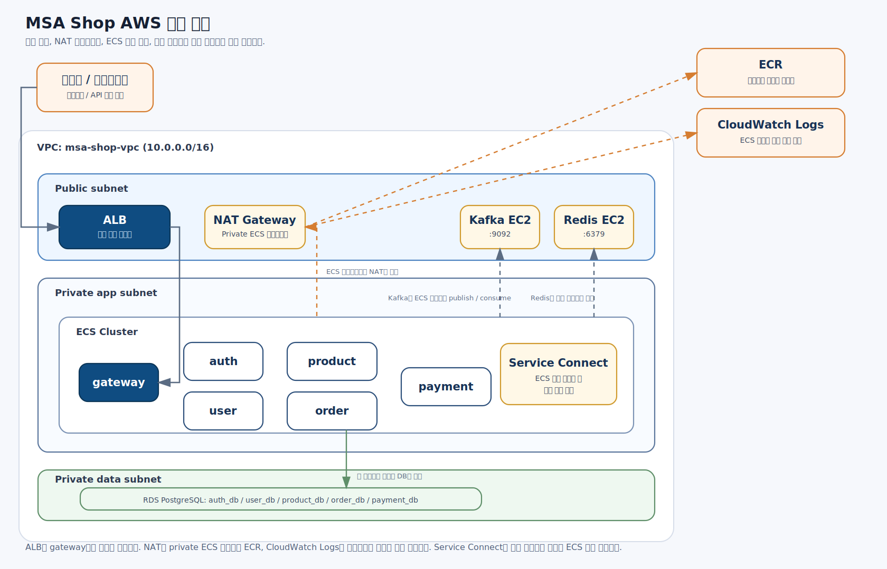
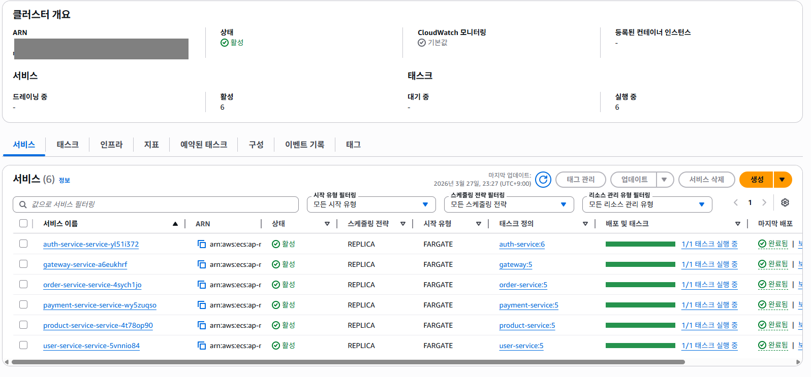
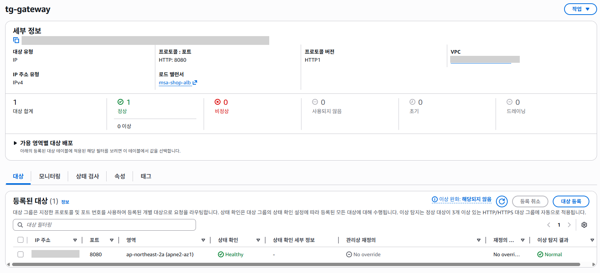

# MSA Shop

Kafka Saga와 Outbox/Inbox Claim 패턴을 적용해 주문-재고-결제 흐름을 분산 트랜잭션으로 구현한 이커머스 백엔드 MSA 프로젝트

## 1. 프로젝트 개요

`MSA Shop`은 Spring Boot 기반으로 구현한 이커머스 백엔드 프로젝트입니다.  
이 프로젝트의 목적은 단순 CRUD 기능을 구현하는 것이 아니라, 주문, 재고, 결제처럼 여러 서비스의 상태가 함께 바뀌는 문제를 MSA 환경에서 어떻게 일관성 있게 처리할 수 있는지 검증하는 것이었습니다.

서비스는 아래와 같이 분리했습니다.

- `gateway`
- `auth-service`
- `user-service`
- `product-service`
- `order-service`
- `payment-service`

각 서비스는 자신의 책임과 데이터를 중심으로 분리했고, 긴 비즈니스 흐름은 Kafka 기반 Saga로 연결했습니다.  
최종적으로는 이 구조를 AWS ECS Fargate, ALB, RDS, Kafka, Redis 환경에 직접 배포해 실제로 동작하는 상태까지 검증했습니다.

## 2. 해결하려고 한 문제

이 프로젝트에서 해결하려고 한 핵심 문제는 다음과 같습니다.

### 2.1 서비스가 분리된 환경에서 주문 흐름을 어떻게 처리할 것인가

주문, 재고, 결제는 도메인 성격상 서로 강하게 연결되어 있습니다.  
하지만 MSA 환경에서는 이 세 기능이 각각 다른 서비스에 분리되기 때문에, 하나의 DB 트랜잭션으로 묶어 처리할 수 없습니다.

즉 아래와 같은 문제가 발생합니다.

- 주문 생성 이후 재고 차감과 결제 요청을 어떤 순서로 처리할 것인가
- 결제는 성공했는데 재고가 부족하면 어떻게 할 것인가
- 재고 예약은 성공했지만 결제가 실패하면 어떤 보상 흐름이 필요한가
- 이벤트 기반 구조에서 중복 소비와 재처리는 어떻게 제어할 것인가

이 프로젝트는 이런 문제를 단순 동기 HTTP 호출이 아니라, **Kafka Saga + Outbox/Inbox Claim 패턴**으로 해결하는 방향을 선택했습니다.

### 2.2 로컬 환경이 아니라 실제 배포 환경에서도 설명 가능한 구조를 만들 것

로컬 Docker Compose 환경에서만 동작하는 구조는 포트폴리오 설득력이 떨어진다고 판단했습니다.  
그래서 최종 목표를 아래와 같이 잡았습니다.

- 외부 요청은 ALB와 gateway를 통해서만 받기
- 내부 서비스는 ECS Fargate로 private subnet에서 실행하기
- 데이터는 RDS PostgreSQL로 분리하기
- Kafka와 Redis는 별도 인프라로 구성하기
- AWS에서 실제로 서비스가 뜨고 요청이 통하는 상태까지 검증하기

## 3. 설계와 구현

## 3.1 서비스 분리

각 서비스는 아래 책임을 중심으로 분리했습니다.

- `gateway`: 외부 요청 진입, JWT 검증, 내부 서비스 라우팅
- `auth-service`: 로그인, 토큰 발급, 인증 정보 관리
- `user-service`: 사용자 프로필과 상태 관리
- `product-service`: 상품 및 재고 관리
- `order-service`: 주문 생성, 주문 상태 관리
- `payment-service`: 결제 요청, 결제 결과 반영

이 구조를 통해 단일 애플리케이션 내부 계층 분리가 아니라, **서비스 단위의 경계와 책임**을 명확하게 가져가고자 했습니다.

## 3.2 주문-재고-결제 흐름을 Kafka Saga로 처리

프로젝트의 핵심 흐름은 주문-재고-결제 Saga입니다.

기본 아이디어는 다음과 같습니다.

1. `order-service`가 결제 시작 요청을 받는다
2. 주문 상태를 `PENDING_PAYMENT`로 전이한다
3. `product-service`가 재고를 먼저 예약한다
4. 재고 예약 성공 후에만 `payment-service`가 결제를 진행한다
5. 결제 결과에 따라 `product-service`가 예약을 확정하거나 해제한다
6. `order-service`가 최종 결제 결과를 반영한다

이 구조에서 중요하게 본 점은 **결제 전에 재고를 먼저 예약한다**는 것입니다.  
이를 통해 `결제는 성공했는데 재고가 부족한 상황`을 앞단에서 차단할 수 있도록 설계했습니다.

## 3.3 주문 상태 관리 방식

주문 상태는 단순히 `성공 / 실패`로 나누지 않았습니다.  
현재 구조에서는 다음 상태를 중심으로 관리합니다.

- `CREATED`
- `PENDING_PAYMENT`
- `PAID`
- `CANCELLED`

특히 재고 예약 실패나 결제 실패가 발생하더라도 주문을 곧바로 완전 실패 상태로 닫지 않고, `PENDING_PAYMENT`를 유지한 채 사용자가 재결제를 하거나 취소할 수 있는 구조를 택했습니다.

이는 실제 운영 환경에서 주문 실패를 너무 공격적으로 확정하는 것보다, 사용자의 선택 가능성을 남기는 쪽이 더 현실적이라고 판단했기 때문입니다.

## 3.4 Outbox / Inbox Claim 패턴 적용

이벤트 기반 구조를 구현할 때 단순히 Kafka에 메시지를 발행하는 것만으로는 충분하지 않다고 판단했습니다.  
멀티 인스턴스 환경에서는 아래 문제가 자연스럽게 따라옵니다.

- 같은 이벤트를 여러 인스턴스가 동시에 소비하는 문제
- 이벤트 발행과 DB 저장의 일관성 문제
- 처리 중 장애가 났을 때 재처리 기준이 불분명해지는 문제

이를 해결하기 위해 아래 구조를 적용했습니다.

### Outbox

- 비즈니스 데이터와 이벤트를 같은 트랜잭션 안에서 저장
- 별도 relay가 outbox를 읽어 Kafka로 발행
- 발행 전후 상태를 저장해 재시도 가능하게 구성

특히 핵심 상태 변경과 후속 이벤트 적재를 하나의 로컬 트랜잭션 안에서 처리하도록 맞췄다.  
이를 통해 DB 상태는 반영되었지만 이벤트는 사라지거나, 반대로 이벤트는 나갔지만 로컬 상태가 남지 않는 상황을 줄이고자 했다.

### Inbox Claim

- consumer 측에서 `processed_event`를 단순 이력 테이블이 아니라 claim 테이블처럼 사용
- 여러 인스턴스가 동시에 메시지를 받아도 한 worker만 claim 성공
- stale claim takeover를 고려해 재처리 가능성 확보

이 구조를 통해 Kafka 메시지 처리의 안정성과 멱등성을 강화했습니다.

## 3.5 실패 대응 요소 반영

이 프로젝트에서는 단순 성공 흐름만 구현하지 않고, 운영 관점에서 필요한 실패 대응 요소도 함께 고려했습니다.

- Retry
- DLQ
- `APPROVAL_UNKNOWN`
- reconciliation

예를 들어 PG 결과가 애매한 경우 결제 row를 곧바로 성공/실패로 단정하지 않고 `APPROVAL_UNKNOWN`으로 저장한 뒤, reconciliation 흐름으로 최종 상태를 확정하도록 구성했습니다.

또한 `payment-service`는 외부 PG 호출을 로컬 트랜잭션 안에 오래 물고 가지 않도록 구조를 정리했습니다.

- 먼저 `REQUESTED` 상태를 저장하고 커밋
- 이후 PG 호출은 트랜잭션 밖에서 수행
- 마지막으로 `APPROVED / FAILED / APPROVAL_UNKNOWN` 반영과 outbox 적재를 별도 로컬 트랜잭션으로 처리

즉 외부 결제 호출과 로컬 상태 변경을 한 트랜잭션처럼 착각하지 않고, **로컬 상태 저장과 outbox 적재의 경계를 명확히 분리한 뒤 reconciliation으로 복구 가능성을 확보하는 방향**으로 정리했습니다.

즉 이 프로젝트는 “Kafka를 붙였다” 수준이 아니라, **실패했을 때 어떻게 복구하고 추적할 것인가**까지 포함해 설계한 프로젝트입니다.

## 4. AWS 배포 구조

## 4.1 전체 구조

AWS에서는 하나의 VPC 안에 다음 계층을 분리했습니다.

- `public subnet`
- `private app subnet`
- `private data subnet`

리소스 배치는 다음과 같습니다.

- `ALB`, `NAT Gateway`, `Kafka EC2`, `Redis EC2`는 public subnet
- `gateway`, `auth`, `user`, `product`, `order`, `payment`는 private app subnet
- `RDS PostgreSQL`은 private data subnet

이 구조를 통해 외부에 노출해야 하는 리소스와 내부에서만 동작해야 하는 리소스를 분리했습니다.

## 4.2 ECS Fargate 사용

애플리케이션 서비스는 모두 `ECS Fargate`로 실행했습니다.  
즉 EC2 위에 직접 컨테이너를 올리는 방식이 아니라, AWS가 관리하는 컨테이너 실행 환경 위에서 서비스만 배포하는 방식을 선택했습니다.

이 방식을 택한 이유는 다음과 같습니다.

- EC2 운영보다 애플리케이션 배포와 구조 검증에 집중할 수 있음
- 서비스별 task 단위로 배포와 재시작이 가능함
- ALB, CloudWatch Logs, Service Connect와 연계하기 좋음

## 4.3 Service Connect 적용

내부 서비스 간 통신은 `Service Connect`를 사용해 이름 기반으로 처리했습니다.

즉 gateway는 내부 서비스의 실제 IP를 알 필요 없이 `auth-service`, `product-service` 같은 이름으로 통신할 수 있습니다.  
이 구조를 통해 Docker Compose 시절의 서비스 이름 기반 통신과 유사한 감각을 유지하면서, ECS 재배포 이후에도 비교적 안정적으로 연결할 수 있었습니다.

## 4.4 RDS, Kafka, Redis 구성

데이터 계층은 `RDS PostgreSQL`을 사용했습니다.  
서비스별로 DB 인스턴스를 따로 두지 않고, 하나의 PostgreSQL 인스턴스 안에 아래 DB를 분리했습니다.

- `auth_db`
- `user_db`
- `product_db`
- `order_db`
- `payment_db`

Kafka와 Redis는 이번 프로젝트 범위에서는 관리형 서비스 대신 EC2 위에 Docker 컨테이너로 직접 실행했습니다.  
운영 최적화보다 구조 검증과 배포 경험 확보를 우선한 선택이었습니다.

## 5. AWS 배포 과정에서 겪은 문제와 해결

이번 프로젝트의 가치 중 하나는 실제 AWS 배포 과정에서 구조가 자연스럽게 검증되었다는 점입니다.  
단순히 설계만 한 것이 아니라, 실제로 배포하면서 여러 문제를 직접 해결해야 했습니다.

## 5.1 private subnet의 outbound 문제

처음에는 private subnet에 ECS 서비스를 두고도 task가 정상적으로 뜨지 않는 문제가 있었습니다.

처음에는 보안 그룹 아웃바운드를 열어두었으니 외부 통신도 될 것이라고 생각했지만, 실제로는 보안 그룹과 라우팅은 별개였습니다.

- 보안 그룹: 통신 허용 여부
- Route Table / NAT / IGW: 실제 경로

결과적으로 private app subnet의 ECS task가 ECR 이미지 pull과 CloudWatch Logs 전송을 하려면 outbound 경로가 필요했고, 이를 위해:

- public subnet에 `NAT Gateway` 생성
- private app subnet route table의 기본 경로를 NAT Gateway로 연결

하는 방식으로 문제를 해결했습니다.

## 5.2 CloudWatch Logs 설정 문제

초기에는 CloudWatch Logs 설정 때문에 ECS task가 초기화 단계에서 실패하는 문제가 있었습니다.

원인은 단순 권한 문제가 아니라, 다음 요소가 겹친 상태였습니다.

- 로그 그룹 이름 mismatch
- ECS가 실제로 바라보는 로그 그룹과 수동 생성한 로그 그룹 불일치
- 애플리케이션 로그와 Service Connect 로그 구분 부족

결과적으로 로그 그룹 이름을 명확히 정리하고, ECS 설정과 실제 로그 그룹 이름을 일치시키는 방식으로 해결했습니다.

## 5.3 RDS와 환경변수 문제

RDS를 만든 뒤에도 서비스가 바로 붙지 않았습니다.  
그 이유는 두 가지였습니다.

- 서비스별 DB를 실제로 생성해야 했음
- 환경변수 값을 잘못 주입한 경우가 있었음

예를 들어 `RDS_ENDPOINT`에 JDBC URL 전체를 넣으면 애플리케이션 설정에서 URL이 중복 합성되었고, Flyway와 JPA 초기화 단계에서 실패했습니다.

이 문제를 해결하면서 아래 원칙을 정리했습니다.

- endpoint에는 호스트만 넣기
- JDBC URL은 애플리케이션 설정에서 조합하기
- AWS용 설정은 별도 프로필로 분리하기

## 5.4 AWS 전용 프로필 분리

처음에는 `local`, `docker`, `saga-e2e` 프로필 조합 위에 ECS 환경변수를 계속 덧붙이는 방식으로 접근했습니다.  
하지만 이 구조는 포트, 내부 호출 주소, 외부 의존성 endpoint가 섞이면서 빠르게 복잡해졌습니다.

결국 서비스별로 `application-aws.yml`을 추가해 AWS 배포 설정을 분리했고, ECS에서는 최소한의 환경변수만 주입하도록 정리했습니다.

이후부터는 설정 책임이 훨씬 명확해졌습니다.

## 5.5 gateway health check 문제

ALB 뒤에 있는 gateway는 health check가 필수였습니다.  
초기에는 별도 health endpoint가 없어서 target group health check가 실패했고, gateway task가 안정적으로 유지되지 않았습니다.

이를 해결하기 위해:

- `GET /health` 엔드포인트 추가
- 해당 경로는 인증 없이 허용
- ALB target group health check path를 `/health`로 변경

하는 방식으로 gateway를 안정적으로 올릴 수 있었습니다.

## 6. 구현과 배포 과정에서 정리한 코드

AWS 배포에 맞추는 과정에서 단순 설정만 수정한 것은 아닙니다.  
현재 구조 기준으로 의미가 약해진 코드도 함께 정리했습니다.

대표적으로:

- 서비스별 `application-aws.yml` 추가
- order-service에서 product-service로 직접 재고 차감을 호출하던 구경로 제거
- payment-service의 트랜잭션 경계 재정리 및 불필요한 잔재 코드 정리
- gateway health endpoint 추가

즉 단순 배포 작업이 아니라, **현재 아키텍처 기준으로 불필요한 경로를 걷어내고 설정 책임을 다시 나누는 작업**이 함께 진행되었습니다.

## 7. 결과

최종적으로는 아래를 확인했습니다.

- ECS Fargate에 서비스 6개 배포
- ALB를 통한 gateway 연결
- target group healthy 상태 확인
- RDS, Kafka, Redis 포함 전체 구조 동작 확인
- `/health`, 상품 조회, 로그인, 주문/결제 API 흐름 검증

즉 이 프로젝트는 로컬 개발 환경에만 머무르지 않고, AWS 배포 환경에서도 핵심 흐름을 검증한 상태까지 정리되었습니다.

## 8. 기술 스택

- `Java 21`
- `Spring Boot 3.2`
- `Spring Security`
- `Spring Data JPA`
- `Kafka`
- `PostgreSQL`
- `Redis`
- `Docker`
- `Gradle`
- `AWS ECS Fargate`
- `ALB`
- `RDS`
- `EC2`
- `CloudWatch Logs`
- `ECR`
- `NAT Gateway`
- `Service Connect`

## 9. 이 프로젝트를 통해 강조할 수 있는 역량

이 프로젝트를 통해 아래 역량을 보여줄 수 있다고 생각합니다.

- 서비스 경계를 분리해 도메인 책임을 설계하는 능력
- Kafka Saga로 분산 트랜잭션 문제를 푸는 능력
- Outbox / Inbox Claim 기반 이벤트 처리 안정성을 고려하는 능력
- 실패 시나리오를 포함해 구조를 설계하는 능력
- AWS 배포 환경에서 네트워크, 로그, health check, 설정 문제를 직접 해결하는 능력

## 10. 마무리

`MSA Shop`은 단순히 기능이 많은 프로젝트라기보다, **서비스가 분리된 환경에서 실제로 문제가 되는 지점을 어떻게 설계하고 구현하고 배포했는지 설명할 수 있는 프로젝트**입니다.

특히 아래 세 가지를 함께 보여줄 수 있다는 점이 강점이라고 생각합니다.

- MSA 서비스 분리와 도메인 경계 설정
- Kafka Saga와 Outbox/Inbox Claim 기반 이벤트 처리
- AWS ECS Fargate 기반 실제 배포 및 트러블슈팅 경험

이 프로젝트를 통해 구조 설계, 구현, 배포, 문제 해결을 하나의 흐름으로 끝까지 가져가는 경험을 쌓을 수 있었습니다.
