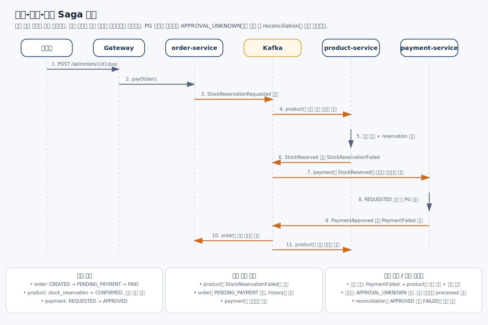
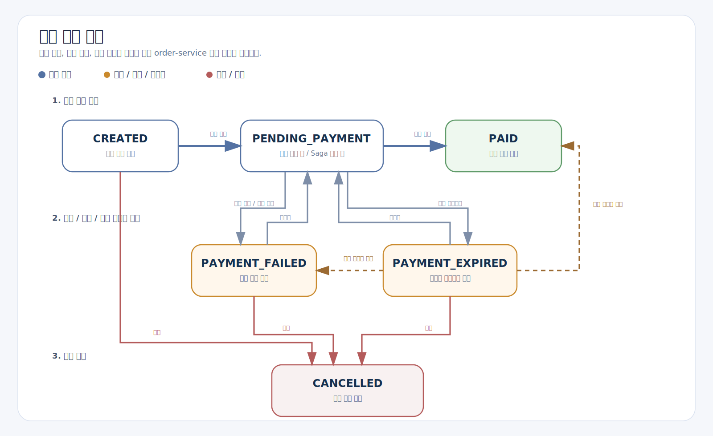
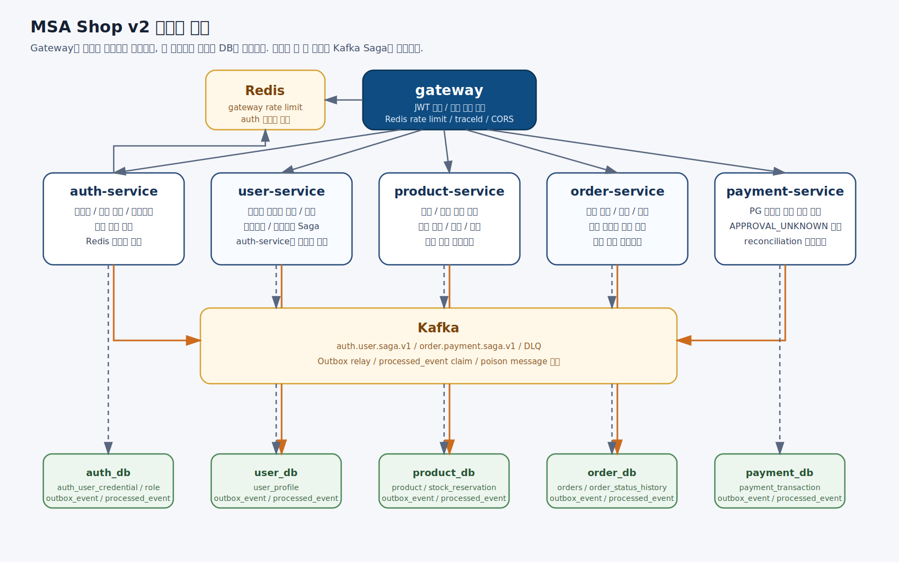

# MSA Shop v2

주문, 재고, 결제가 분리된 환경에서 단일 트랜잭션 없이도 하나의 주문 흐름을 일관되게 완료할 수 있는지 검증하기 위해 만든 Spring Boot 기반 MSA 프로젝트입니다.

이 프로젝트의 목적은 CRUD 기능을 많이 만드는 것이 아니라, **실패가 정상인 분산 환경에서 정합성, 멱등성, 복구 가능성을 어떻게 설계하고 검증할 것인가**를 코드와 배포 환경에서 확인하는 것이었습니다.

## 한눈에 보기

- 구성: gateway 포함 6개 Spring Boot 애플리케이션 + frontend
- 핵심 설계: Kafka Saga, Outbox, Processed Event Claim, idempotency key, reconciliation
- 핵심 상태 모델: `APPROVAL_UNKNOWN`, `PAYMENT_EXPIRED`, 재고 `RESERVED/CONFIRMED/RELEASED/EXPIRED`
- 검증 범위: 단위/통합/E2E 테스트 + AWS 배포 검증
- 저장소 테스트 클래스 수: 49개

## 이 프로젝트가 해결한 문제

MSA에서는 주문 생성, 재고 차감, 결제 승인 같은 흐름을 하나의 로컬 트랜잭션으로 묶을 수 없습니다. 각 서비스는 자기 DB만 책임지고, 서비스 간 상태는 메시지와 API 호출을 통해 맞춰야 합니다.

이 프로젝트에서 집중한 질문은 아래와 같습니다.

- 주문은 생성됐는데 재고가 부족하면 어떤 기준으로 정리할 것인가
- 재고는 예약됐는데 결제가 실패하면 누가 어떤 상태를 되돌릴 것인가
- 결제 결과가 timeout이나 네트워크 예외로 모호하면 실패로 단정해도 되는가
- Kafka 메시지가 중복 소비돼도 같은 결과를 보장할 수 있는가
- 만료 후 늦게 도착한 결과나 재결제까지 상태 모델에 포함할 수 있는가

즉 핵심은 **분리된 서비스들이 서로 다른 DB를 가진 상태에서 하나의 주문 흐름을 어떻게 일관되게 완료할 것인가**였습니다.

## 핵심 설계 결정

### 1. Saga + Outbox + Processed Event Claim

단일 트랜잭션 대신 Saga로 주문-재고-결제 흐름을 연결했습니다.

- 상태 변경과 이벤트 적재는 같은 로컬 트랜잭션에서 처리
- relay가 outbox를 읽어 Kafka로 발행
- consumer는 `processed_event`를 먼저 claim
- 동일 이벤트가 중복 도착하거나 여러 인스턴스가 동시에 처리해도 같은 작업을 반복하지 않도록 설계

이 구조로 발행 유실, 중복 소비, 멀티 인스턴스 경쟁 문제를 줄이려 했습니다.



_주문 상태 변경, 재고 예약, 결제 실행을 단일 트랜잭션 대신 Saga로 연결한 흐름_

### 2. `APPROVAL_UNKNOWN` + reconciliation

결제는 승인과 실패만 있는 문제가 아니었습니다. PG timeout, 네트워크 단절, 응답 지연처럼 결과를 즉시 확정할 수 없는 경우가 존재했습니다.

이런 경우를 곧바로 실패로 처리하면 이미 승인된 결제를 잘못 보상할 수 있기 때문에, `payment-service`는 이 상태를 `APPROVAL_UNKNOWN`으로 저장하고 현재 메시지는 처리 완료로 남긴 뒤, reconciliation이 나중에 PG 상태를 다시 조회해 최종 승인 또는 실패로 확정하도록 했습니다.

즉 이 프로젝트의 중요한 설계 포인트는 **모르는 사실을 억지로 실패로 단정하지 않고 별도 상태로 남기는 것**이었습니다.

### 3. 예약 재고 + 만료 + 늦게 도착한 결과까지 포함한 상태 모델

결제 후 재고를 차감하면 동시에 여러 주문이 같은 재고를 잡을 수 있기 때문에, 재고는 결제 전에 먼저 예약하고 결과에 따라 확정 또는 해제하도록 모델링했습니다.

- 결제 전: `RESERVED`
- 결제 승인: `CONFIRMED`
- 결제 실패: `RELEASED`
- 예약 만료: `EXPIRED`

주문 상태도 단순 성공/실패로 끝내지 않았습니다.

- `PAYMENT_EXPIRED`를 별도 상태로 두고 만료 처리
- 만료 후 늦게 도착한 승인 이벤트는 `PAID`로 반영
- 만료 후 늦게 도착한 실패 이벤트는 `PAYMENT_FAILED`로 반영
- `PAYMENT_EXPIRED` 주문은 재결제를 허용해 다시 `PENDING_PAYMENT`로 진입 가능

즉 "만료"를 종료 상태가 아니라 **늦은 결과와 재시도까지 고려한 상태 전이 모델**로 설계했습니다.



_결제 진행 중 실패, 만료, 늦게 도착한 결과까지 포함한 주문 상태 전이_

## 무엇을 검증했는가

이 프로젝트는 구조 설명에서 끝내지 않고, 테스트와 배포 환경에서 아래 시나리오를 확인했습니다.

- 단위 테스트로 주문 상태 전이, 재고 예약/해제/확정, 결제 승인/실패/불명확 상태 반영을 검증
- 통합 테스트로 Outbox 적재, `processed_event` 처리, 재고 부족 시 실패 반영, `PAYMENT_EXPIRED` 저장을 검증
- reconciliation 테스트로 `APPROVAL_UNKNOWN`이 나중에 승인 또는 실패로 보정되는 흐름 검증
- E2E 테스트로 로그인, refresh/logout, 상품 권한, 주문 생성, 결제 성공 후 `PAID` 반영과 재고 감소를 검증
- E2E 테스트로 PG 실패, 재고 부족, `APPROVAL_UNKNOWN -> reconciliation`, `PAYMENT_EXPIRED`, 만료 후 재결제, 결제 완료 주문 취소 불가를 검증
- AWS 배포 환경에서 gateway health check, 로그인, 주문, 결제 API가 실제 인프라 위에서 동작하는지 확인

즉 이 프로젝트의 결과는 **정상 흐름, 실패 흐름, 불명확한 상태, 만료, 재시도와 늦은 결과까지 코드와 배포 환경에서 검증했다**는 점입니다.

## 서비스 구성



_Gateway, 인증, 주문, 상품, 결제 서비스를 분리하고 Kafka, Redis, 각 DB를 역할에 맞게 배치한 구조_

- `gateway`
  - 모든 요청 진입점
  - JWT 검증, 내부 헤더 전파, Redis rate limit 담당
- `auth-service`
  - 로그인, 토큰 발급, 계정 잠금, 회원가입 Saga 시작
- `user-service`
  - 사용자 프로필 생성 및 관리
- `product-service`
  - 상품 정보와 재고 예약/해제/확정 담당
- `order-service`
  - 주문 생성, 조회, 취소, 결제 Saga 시작, 최종 상태 반영 담당
- `payment-service`
  - PG 호출, 결제 상태 저장, reconciliation 담당

## AWS 배포와 검증 범위

최종적으로는 아래 구조에서 배포를 검증했습니다.

- Public ALB
- frontend nginx EC2
- Internal ALB
- gateway ECS
- backend ECS services
- RDS PostgreSQL
- Kafka EC2
- Redis EC2

프론트엔드 same-origin 구조를 유지하기 위해 public ALB와 internal ALB를 분리했습니다.

## 로컬 실행 및 데모 계정

AWS 데모 서버는 비용 문제로 상시 운영하지 않습니다. 대신 저장소의 Docker Compose 구성으로 로컬에서 전체 백엔드 스택을 실행해 확인할 수 있습니다.

```bash
docker compose -f infra/docker-compose.full.yml up --build -d
```

- Gateway: <http://localhost:8080>
- 로컬 seed 계정
  - Admin: `admin` / `1234`
  - User: `user1` / `1234`

위 계정은 로컬 실행 확인용 seed 계정이며, 운영/배포 계정이 아닙니다.

프론트엔드까지 확인하려면 Vue 프론트엔드를 실행해 Gateway와 연동할 수 있습니다.

```bash
cd services/frontend
npm install
npm run dev
```

개발 서버는 기본적으로 <http://localhost:5173>에서 실행됩니다.

## 링크

- 프로젝트 저장소: <https://github.com/Chang97/msa-shop-v2>
- AWS 배포 구조 정리: <https://chang97.tistory.com/162>
- ECS/Fargate 배포 시행착오 정리: <https://chang97.tistory.com/163>
- 프론트 연결 포함 최종 배포 구조: <https://chang97.tistory.com/164>

## 프로젝트를 통해 키운 역량

이 프로젝트를 진행하며 MSA 구조 설계부터 비동기 Saga 흐름, 장애 상황을 고려한 상태 모델링, 배포 환경 검증까지 직접 다뤘습니다.

- 서비스 경계를 나누고 주문-재고-결제 흐름을 Saga로 모델링
- Outbox, processed event, idempotency key로 메시지 유실, 중복, 재처리 문제 대응
- 결제 불명확 상태, 만료, 늦게 도착한 결과, 재결제까지 포함한 상태 전이 설계
- 단위/통합/E2E 테스트와 AWS 배포 환경에서 주요 흐름 검증
